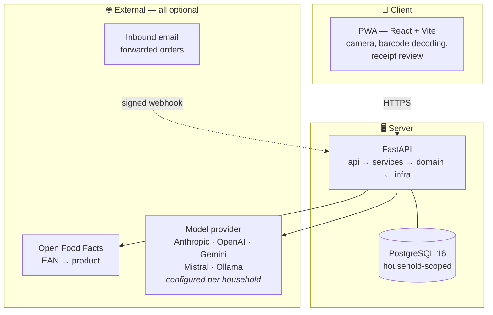
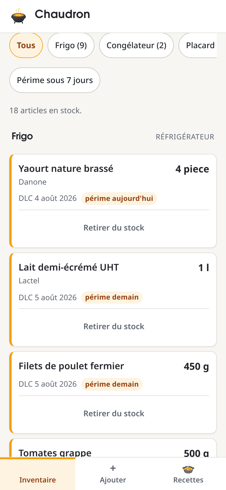
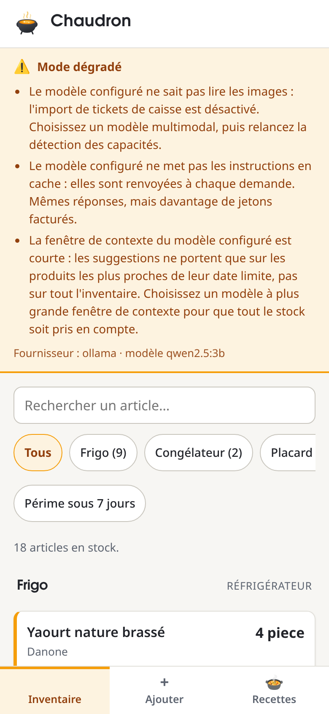
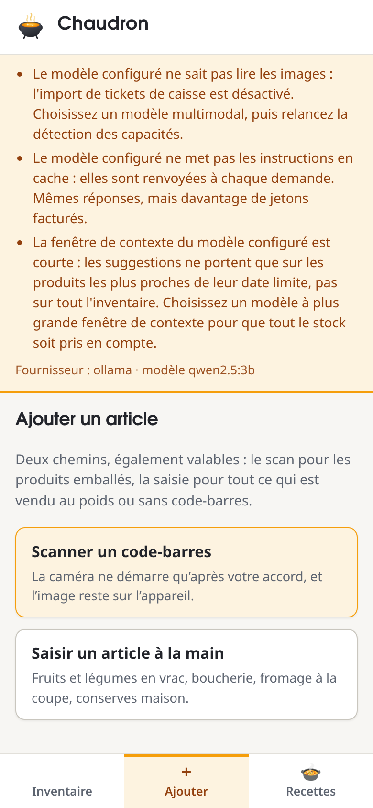

<div align="center">


**Throw in what you have. See what comes out.**

Self-hostable food stock management with AI recipe suggestions and receipt
scanning — running on *your* model, *your* key, *your* server.

[](LICENSE)
[](https://github.com/ClaraVnk/chaudron/actions/workflows/ci.yml)
[](https://www.python.org/)
[](https://github.com/astral-sh/ruff)
[](https://mypy-lang.org/)
[](https://podman.io/)
[](CONTRIBUTING.md)

</div>

---

> [!WARNING]
> **Early, and not safe to expose to the internet yet.**
>
> The first slice works end to end — inventory, barcode scanning, recipe
> suggestions from a real model — and the screenshots below are of it running.
> But there is **no authentication**: the current API identifies a household by
> a header, which is an address, not a proof. Run it on a private network or
> behind your own auth until that lands. See
> [the security audit](docs/security-audit-2026-08.md), finding AUD-001.
>
> Not built yet: receipt import, the shopping list, and any way to edit an item
> once it is added.

---

## Why

Most food inventory apps want your data, your subscription, or both. The ones
that generate recipes send your grocery habits to a service you don't control,
and stop working when the company pivots.

Chaudron takes the opposite position: **you host it, and you bring your own
model.** There is no Chaudron cloud, no Chaudron account, no Chaudron API key. The
application never pays for anyone's inference and never sees anyone's data.

## Features

| | |
|---|---|
| | | |
|---|---|---|
| 📦 **Stock tracking** | ✅ built | What you own, where it's stored, and when it expires — per household, not per person. Use-by and best-before are distinct: conflating them means either anxious alerts on dry pasta or silence on minced beef. |
| 📷 **Barcode scanning** | ✅ built | Decoded **in the browser** — the server only ever sees thirteen characters, never a video stream. Products resolve through [Open Food Facts](https://world.openfoodfacts.org/). |
| 🍳 **Recipe suggestions** | ✅ built | Generated from the stock actually on hand. Whether an ingredient is in stock is **recomputed against your inventory**, never taken from the model's word for it. |
| 🔑 **Bring your own model** | ✅ built | Anthropic, OpenAI, Gemini, Mistral, or a local Ollama. Your key, your bill, your choice. |
| 🏠 **Self-hosted** | ✅ built | Podman + systemd quadlets, PostgreSQL row-level security. Runs on a small VPS or a home server. |
| 🧾 **Receipt import** | ⏳ designed | Photograph a till receipt; a vision model extracts the lines. **Nothing will be written without your review** — a model that reads `PDT NOUV 1KG` is right about half the time, and a silently wrong stock is worse than an empty one. |
| 🛒 **Shopping list** | ⏳ designed | Built from what ran out, exportable to the tools you already use. |
| 🔐 **Accounts** | ❌ not started | The blocker for exposing this to the internet. |

## Bring your own model

Each household configures its own model access. There is deliberately **no mode
in which the application funds inference for its users** — that decision removes
spend caps, quotas, abuse protection and a large amount of GDPR exposure in one
stroke.

| Mode | What you provide | Who pays |
|---|---|---|
| `byok` | Your own API key — Anthropic, OpenAI, Gemini or Mistral | You, directly to the provider |
| `ollama` | A base URL and a model name | Nobody — local inference |
| `instance_owner` | Nothing — uses the server's configured key | The operator, for their own household only |

Supported providers:

| Provider | Models | Vision | Notes |
|---|---|---|---|
| **Anthropic** | Claude | ✅ | Default in documentation and examples |
| **OpenAI** | GPT | ✅ | The API behind ChatGPT — a ChatGPT Plus subscription is *not* an API key |
| **Google** | Gemini | ✅ | |
| **Mistral AI** | Mistral, Pixtral | ✅ | **EU-hosted** — your grocery data never leaves European jurisdiction |
| **Ollama** | Whatever you load | ⚠️ depends | Fully local, zero outbound calls. Capabilities detected at configuration time |

> [!TIP]
> If keeping data under EU jurisdiction matters to you, **Mistral** (EU-hosted)
> or **Ollama** (nothing leaves your machine) are the two options that give you
> that without compromise.

### Honest about degradation

Providers are not equivalent. Reading a creased, faded thermal receipt is hard,
and a small local model will do it worse than a frontier one.

Chaudron does not paper over this. Providers **declare their capabilities**, and
the interface tells you what you're getting:

- Missing a capability that can be approximated → the feature works, with a
  documented quality drop.
- Missing a capability that changes the experience → **degraded mode**, shown as
  a persistent indicator explaining exactly what is reduced.
- Missing a capability the feature depends on → the feature is **disabled with
  the reason displayed**, not left to fail at runtime.

You will never discover a limitation at the moment it breaks.

## Architecture



Dependencies only point inward: `api → services → domain ← infra`. The domain
layer knows nothing about SQLAlchemy, HTTP, or any model SDK — it declares
interfaces, and infrastructure implements them. That is what makes three model
providers possible without the recipe logic knowing any of them exist.

Every business table carries a `household_id`, from the very first commit — and
since the security audit, PostgreSQL enforces it. A query that forgets its tenant
filter now returns nothing because the *database* refuses it, not because the
code remembered. See [ADR 0006](docs/adr/0006-multi-tenant-from-day-one.md).

## Screenshots

Captures of the application running: real seeded stock, a real backend, and a
real local model behind the suggestions. Nothing here is a mockup.

| Inventory | Degraded mode | Add an item |
|---|---|---|
|  |  |  |

The middle one is the part worth looking at. That household is running
`qwen2.5:3b` locally, so the app says — permanently, before anything is
attempted — that receipt import is off because the model cannot read images,
that instructions are not cached so every request bills more tokens, and that
the context window only fits the items closest to expiry. You are told what you
are getting, not shown an error once it fails.

## Quick start

> [!IMPORTANT]
> No authentication yet (see the warning at the top). Run this on a machine you
> control, not on a public address.

Requires [uv](https://docs.astral.sh/uv/), Podman, and Node.js 22+.

```sh
git clone https://github.com/ClaraVnk/chaudron.git && cd chaudron
cp .env.example .env          # the app refuses to start if this is incomplete

# Database
podman run -d --name chaudron-db \
  -e POSTGRES_PASSWORD="$(openssl rand -hex 16)" \
  -v chaudron-db-data:/var/lib/postgresql/data:Z \
  -p 127.0.0.1:5432:5432 docker.io/library/postgres:16   # loopback only, never 0.0.0.0

# Backend
cd backend && uv sync && uv run alembic upgrade head
uv run python scripts/seed.py   # a demo household; prints the X-Household-Id to use
uv run uvicorn chaudron.api.main:app --reload

# Frontend
cd ../frontend && cp .env.example .env.local   # point it at the API, paste the household id
npm install && npm run dev
```

Liveness and readiness are separate endpoints on purpose: `/healthz` says the
process is alive, `/readyz` says it can actually serve traffic.

Row-level security ships enabled, but it only *enforces* once the application
connects as a non-owning role — the table owner bypasses it, and nothing warns
you. `ops/README.md` §6 has the provisioning steps and a `--check` command;
run it, because a silent no-op is exactly what this control must never be.

## Development

```sh
cd backend
uv run ruff check . && uv run ruff format --check .
uv run mypy
uv run pytest --cov
```

Tests run against a **real PostgreSQL instance** via testcontainers. SQLite is
not used anywhere, including in tests — the reasoning is in
[ADR 0003](docs/adr/0003-backend-stack.md).

Containers are built with **Podman**, never Docker. See
[`ops/README.md`](ops/README.md) for the quadlet units and the SELinux labelling
that bind mounts require.

## Documentation

| Document | What it covers |
|---|---|
| [Architecture](docs/architecture.md) | System shape, layers, data flows, the Ollama topology problem |
| [Data model](docs/data-model.md) | Entities, tenancy, units, expiry batches |
| [Scanning notes](docs/technical-notes-scanning.md) | Barcode reading in-browser, camera in a PWA, Open Food Facts |
| [Ingestion notes](docs/technical-notes-ingestion.md) | Inbound email, receipt OCR, shopping list export |
| [API contract](docs/api-contract-v1.md) | The v1 endpoints, frozen before either side was written |
| [Testing strategy](docs/testing-strategy.md) | Tenancy guards, the adapter conformance suite, what is deliberately not tested |
| [Security model](docs/security-model.md) | Threat model, trust boundaries, what is *not* covered |
| [Security audit](docs/security-audit-2026-08.md) | 35 findings against the running application, and what has been closed |
| [Decision records](docs/adr/) | Why things are the way they are — including what it costs |

## Security

The application has been audited against a running instance, not just read: 35
findings, 19 of them proven by exploitation rather than inferred. Closed since:
the fork-triggered deployment path, the SSRF port oracle, prompt injection
through the shared product catalogue, absent rate limiting on the endpoints that
spend money, and application-only tenant isolation — now enforced by PostgreSQL.

Open, and deliberately so: **there is no authentication**. Everything above
assumes an identity layer that does not exist yet, which is why the warning at
the top of this file is not boilerplate.

The audit is committed in full, including the finding that turned out to be
[wrong](docs/security-audit-2026-08.md) — a report you cannot check is not
worth more than one you can.

## Contributing

Read [CONTRIBUTING.md](CONTRIBUTING.md), and note the house rules: Conventional
Commits, PostgreSQL only, Podman only, everything versioned in English, and no
secrets ever.

By participating you agree to the [Code of Conduct](CODE_OF_CONDUCT.md).
Security issues go through [SECURITY.md](SECURITY.md) — not public issues.

## License

[GNU AGPL v3.0 or later](LICENSE).

Copyleft that covers network use: if you run a modified Chaudron as a service, you
owe your users the source. That is deliberate — this project exists so people
can own their food data, and a closed fork serving it back to them would defeat
the point.
