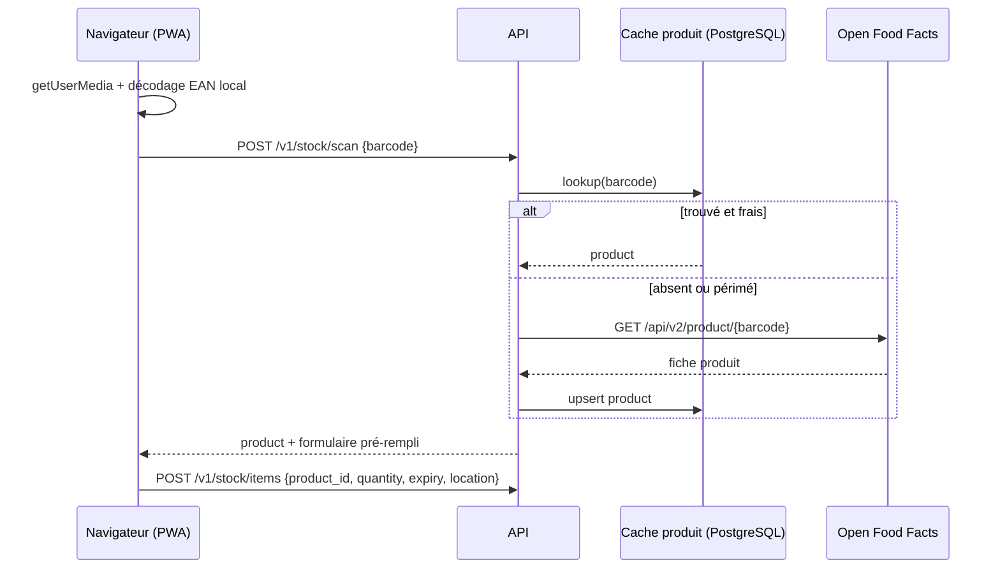
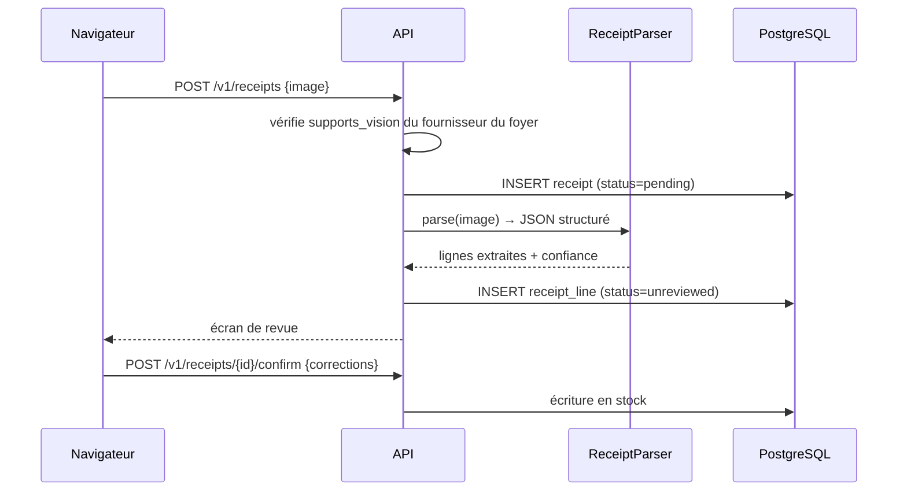

# Architecture

Document de cadrage. Décrit la forme du système, les frontières entre couches et
les flux principaux. Les décisions structurantes et leurs alternatives écartées
sont dans les ADR (`docs/adr/`) ; le détail des entités est dans
[`data-model.md`](data-model.md).

Tous les identifiants techniques cités (tables, colonnes, modules, endpoints)
sont en anglais, conformément à la convention du projet.

---

## 1. Vue d'ensemble

Chaudron est une application auto-hébergeable composée de trois artefacts :

| Artefact | Rôle | Technologie |
|---|---|---|
| `frontend` | PWA installable, accès caméra, saisie | React + Vite |
| `backend` | API, logique métier, orchestration des appels externes | FastAPI, Python 3.14 |
| `db` | Persistance | PostgreSQL 16 |

Trois dépendances externes, toutes optionnelles ou remplaçables :

- **Open Food Facts** — résolution d'un code EAN vers une fiche produit. Absence
  de réponse dégrade l'expérience (saisie manuelle) mais ne casse rien.
- **Un fournisseur de modèle** — configuré *par foyer*, pas par instance.
- **Un service de réception d'emails entrants** — pour capter les récapitulatifs
  de commande transférés. Fonctionnalité entièrement optionnelle.

---

## 2. Découpage en couches

```
backend/src/chaudron/
├── api/        ← handlers HTTP, schémas d'entrée/sortie, authentification
├── services/   ← cas d'usage, orchestration, transactions
├── domain/     ← entités, règles métier, interfaces (ports)
└── infra/      ← SQLAlchemy, clients HTTP, SDK de modèles (adapters)
```

**Règle de dépendance, non négociable :** les flèches ne pointent que vers
l'intérieur.

```
api ──▶ services ──▶ domain ◀── infra
```

`domain` ne connaît ni SQLAlchemy, ni HTTP, ni aucun SDK. Il déclare des
interfaces ; `infra` les implémente ; `services` reçoit les implémentations par
injection. Concrètement :

- Un `import sqlalchemy` dans `domain/` ou `services/` est un bug d'architecture.
- Un handler HTTP qui contient une règle métier est un bug d'architecture.
- Une requête qui accède à la base depuis `api/` est un bug d'architecture.

Ce n'est pas de la cérémonie : c'est ce qui rend le domaine testable sans base de
données ni réseau, et c'est ce qui permet d'avoir trois implémentations de
fournisseur de modèle sans que la logique de génération de recettes ne les
connaisse.

### Ports définis par le domaine

| Port | Implémentations prévues |
|---|---|
| `ProductCatalog` | Open Food Facts, cache local, saisie manuelle |
| `RecipeGenerator` | Anthropic (BYOK ou clé d'instance), Ollama |
| `ReceiptParser` | Anthropic vision, Ollama vision (si capacité déclarée) |
| `StockRepository`, `HouseholdRepository`, … | SQLAlchemy |
| `InboundEmailSource` | Webhook du prestataire retenu |

---

## 3. Flux principaux

### 3.1 Scan d'un code-barres



Le décodage du code-barres se fait **dans le navigateur**, jamais côté serveur :
envoyer un flux vidéo au backend serait absurde en bande passante comme en
latence. Le serveur ne reçoit qu'une chaîne de 13 caractères.

Le cache produit n'est pas une optimisation, c'est une condition de
fonctionnement : il évite de marteler un service communautaire gratuit, et il
permet de continuer à servir les produits déjà connus quand Open Food Facts est
indisponible.

### 3.2 Import d'un ticket de caisse



**Rien n'entre en stock sans revue humaine.** Un modèle qui lit « PDT NOUV 1KG »
et propose « pommes de terre nouvelles, 1 kg » a raison une fois sur deux ; un
stock silencieusement faux est pire qu'un stock vide, parce que l'utilisateur
cesse de faire confiance à l'application. L'écran de revue n'est pas une
protection contre les hallucinations, c'est le produit lui-même.

Si le fournisseur configuré par le foyer ne déclare pas `supports_vision`,
l'endpoint renvoie une erreur explicite et l'interface masque la fonction en
amont, avec la raison affichée. Pas d'échec silencieux, pas de JSON inventé.

### 3.3 Suggestion de recettes

Le stock disponible est sérialisé, envoyé au `RecipeGenerator` du foyer, et la
réponse est contrainte par un schéma strict. La suggestion est persistée avec le
mode de fournisseur, le nom du modèle et le coût en tokens — nécessaire pour
diagnostiquer une plainte de qualité (« les recettes sont nulles » n'appelle pas
la même réponse selon qu'elles viennent d'un petit modèle local ou du modèle par
défaut).

Le prompt système est stable et placé en tête pour bénéficier du prompt caching ;
l'inventaire, volatil, vient après le point de coupe. Ce n'est pas une
micro-optimisation : sur ce flux, le prompt système représente l'essentiel des
tokens d'entrée.

### 3.4 Réception d'un email de commande

Chaque foyer dispose d'une adresse dédiée. L'utilisateur crée une règle de
transfert automatique dans son client mail ; le prestataire de réception poste un
webhook signé au backend, qui rattache l'email au foyer par l'adresse de
destination et traite le contenu comme un ticket (même chemin de revue).

Cette voie évite l'OAuth Gmail — et donc l'audit de sécurité CASA, son coût et son
renouvellement annuel — tout en fonctionnant avec n'importe quelle enseigne et
n'importe quel fournisseur de messagerie. Détails dans
[`technical-notes-ingestion.md`](technical-notes-ingestion.md).

---

## 4. Le point dur : la topologie Ollama

Supporter Ollama n'est pas « ajouter un client HTTP ». Il y a deux situations
irréconciliables, et il faut choisir laquelle on sert.

**Cas A — Ollama colocalisé avec le backend.** L'utilisateur auto-héberge Chaudron
et fait tourner Ollama sur la même machine ou le même réseau que le serveur.
L'appel est serveur → serveur, trivial. C'est le cas de l'auto-hébergeur.

**Cas B — Ollama sur la machine de l'utilisateur.** L'utilisateur se connecte à
une instance Chaudron hébergée ailleurs, mais son Ollama tourne sur son portable ou
son NAS, derrière un NAT. **Le backend ne peut pas l'atteindre.** Le seul
composant du système qui peut joindre ce Ollama est le navigateur de
l'utilisateur.

Servir le cas B impose une inversion : le backend ne fait plus l'appel, il
renvoie au client un *bundle de prompt* que le navigateur envoie lui-même à son
Ollama local, avant de reposter le résultat pour validation et écriture. Cela
suppose que l'utilisateur configure `OLLAMA_ORIGINS` sur son instance pour
autoriser le CORS, et cela déplace une partie de la logique côté client — donc
une surface à valider côté serveur, puisque tout ce qui vient du navigateur est
hostile par défaut.

Le cas A n'a par ailleurs pas les mêmes propriétés de sécurité : une URL de base
fournie par l'utilisateur et appelée par le serveur est une primitive SSRF, et le
filtrage habituel (bloquer les plages privées) est inopérant ici puisque
l'adresse légitime d'un Ollama *est* privée.

**Ce choix est tranché dans l'ADR 0005.** Il conditionne la portée de la
fonctionnalité et vaut la peine d'être fait consciemment plutôt que découvert en
cours de route.

---

## 5. Frontières et contrats

- **API versionnée** sous `/v1/`. Une rupture de contrat crée `/v2/`, elle ne
  modifie pas `/v1/`.
- **Schémas stricts en entrée et en sortie** (Pydantic). Le typage n'est pas de
  la décoration : c'est le seul endroit où l'on peut refuser une donnée avant
  qu'elle ne contamine le reste.
- **Sortie de modèle traitée comme entrée non fiable.** Un JSON produit par un
  LLM passe par la même validation qu'un formulaire posté par un inconnu.
- **Configuration validée au démarrage**, avec arrêt immédiat si elle est
  incomplète. Une application à moitié configurée qui accepte du trafic est un
  incident différé.

---

## 6. Sécurité

| Surface | Traitement |
|---|---|
| Clés API des foyers | Chiffrées au repos, clé de chiffrement hors base, jamais relues par l'API (seuls les 4 derniers caractères sont exposés), jamais journalisées |
| URL Ollama fournie par l'utilisateur | Voir §4 — SSRF, validation obligatoire |
| Isolation entre foyers | `household_id` sur toute table métier ; aucune requête métier sans filtre de tenant ; tests d'isolation dédiés |
| Images de tickets | Contiennent des données de consommation et parfois des données bancaires partielles. Durée de rétention à définir, purge après traitement à privilégier |
| Webhook email entrant | Signature vérifiée, sinon n'importe qui injecte des achats dans n'importe quel foyer |
| Allergènes | Une erreur ici a des conséquences physiques. Ne jamais présenter une information allergène issue d'un modèle comme faisant autorité |

---

## 7. Observabilité

Logs structurés dès le premier commit (pas de `print`), avec `household_id` et
identifiant de requête sur chaque ligne. Les erreurs portent leur contexte plutôt
que d'être avalées.

Trois choses méritent une métrique dès le départ, parce qu'elles sont les seules
à pouvoir dériver silencieusement : le taux d'échec des appels au fournisseur de
modèle, le taux de correction humaine sur les lignes de tickets (proxy direct de
la qualité du parsing), et le taux de codes-barres non résolus par Open Food
Facts.

---

## 8. Ce qui n'est pas encore tranché

- La topologie Ollama retenue pour la v1 (§4).
- Le prestataire de réception d'emails entrants.
- La stratégie d'authentification (session vs JWT, et l'ouverture ou non à un
  fournisseur d'identité externe en phase 2).
- La rétention des images de tickets.
- La licence du projet.
