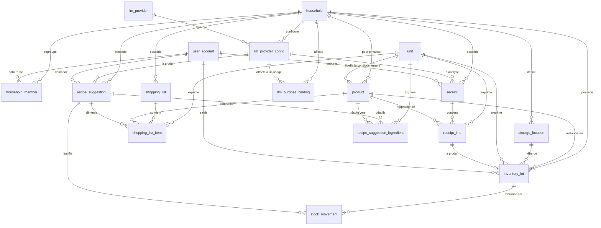

# Chaudron — modèle de données

> Document de cadrage interne. Rédigé en français ; **tous les identifiants cités
> (tables, colonnes, types, valeurs d'enum) sont en anglais** et font foi tels quels.
> Cible : PostgreSQL 16, SQLAlchemy 2.x déclaratif, Alembic.
> Statut : proposition à valider. Le squelette correspondant est dans
> `backend/src/chaudron/domain/models.py` — il n'est câblé à rien pour l'instant.

---

## 1. Objet et portée

Chaudron gère le stock alimentaire d'un **foyer** (`household`) et lui propose des
recettes générées par un modèle, en fonction de ce qui est réellement disponible.

Le modèle doit tenir deux ans et deux phases :

- **Phase 1** — usage perso/famille, quelques foyers, tous connus.
- **Phase 2** — ouverture publique, foyers inconnus, données de tiers.

La seule vraie différence entre les deux phases est la **posture de sécurité**, pas
le schéma : le multi-tenant est présent dès la première migration. Un schéma
mono-utilisateur qu'on « ouvrira plus tard » n'existe pas — on ne rattrape pas un
`household_id` manquant sur douze tables et deux ans d'historique sans downtime.

Hors périmètre de ce document : authentification (sessions, tokens, invitations),
stockage objet des images, planification de menus, courses collaboratives temps réel.

---

## 2. Vue d'ensemble



Trois référentiels sont **globaux** (hors tenant) : `unit`, `llm_provider`, et le
catalogue public de `product`. Tout le reste porte un `household_id` — y compris la
configuration du fournisseur d'IA, qui est propre à chaque foyer (§9).

---

## 3. Conventions transverses

| Sujet | Choix | Pourquoi |
|---|---|---|
| Clés primaires | `uuid` contenant un **UUIDv7**, généré côté application (`uuid.uuid7()`, stdlib Python 3.14) | (1) La PWA doit pouvoir créer une ligne **hors ligne** et la synchroniser sans renumérotation ; un `bigserial` impose un aller-retour serveur. (2) Un entier séquentiel exposé fuit le volume d'activité de *tous* les foyers, ce qui est inacceptable en phase 2. (3) UUIDv7 est ordonné dans le temps : contrairement à v4, il ne détruit pas la localité des B-trees ni le cache. |
| Horodatages | `timestamptz`, jamais `timestamp` | Le foyer a un fuseau, les notifications « périme demain » se calculent dedans. Un `timestamp` naïf est un bug qui attend un déplacement. |
| Dates de péremption | `date` (pas `timestamptz`) | Une DLC imprimée sur un pot est une date calendaire, pas un instant. La convertir en instant force un fuseau arbitraire et décale la date d'un jour selon le lecteur. |
| Quantités | `numeric(12,3)` / `numeric(14,3)` | Jamais de flottant. `0.1 + 0.2 ≠ 0.3` sur un stock de farine finit en ligne fantôme à `-0.0000001 g` impossible à supprimer. |
| Montants | `numeric(12,2)` + `currency char(3)` | Idem, et la devise vient du ticket, pas d'une constante. |
| Coût des appels modèle | `bigint` en **micro-unités monétaires** (`cost_micro`) | Un appel coûte souvent moins d'un centime ; arrondir à deux décimales rend le suivi de coût inutilisable dès qu'on agrège. |
| Suppression | `archived_at timestamptz NULL` sur les référentiels du foyer (`storage_location`, `shopping_list`, `product` privé) | Un lot consommé référence encore son emplacement ; un `DELETE` casse l'historique ou force un `ON DELETE SET NULL` qui perd l'information. |
| Épuisement d'un lot | `depleted_at timestamptz NULL` (distinct de `archived_at`) | Ce n'est pas une suppression : c'est un état métier, qui sert aux statistiques de consommation. Toutes les requêtes « stock actuel » filtrent `depleted_at IS NULL`, d'où les index partiels systématiques. |
| Cascade | `ON DELETE CASCADE` depuis `household` sur tout ce qui lui appartient | La suppression d'un foyer est une opération d'effacement RGPD : elle doit être totale et atomique, pas un script de nettoyage qui oublie une table. |
| Nommage des contraintes | convention explicite sur `MetaData` (`pk_`, `fk_`, `uq_`, `ck_`, `ix_`) | Sans elle, Alembic génère des `DROP CONSTRAINT` sur des noms auto-attribués par PostgreSQL, et les migrations ne sont pas rejouables à l'identique. |
| Secrets stockés | `bytea` contenant un chiffré authentifié, jamais `text` | Le chiffré est binaire ; le passer en base64 coûte 33 % et ajoute un encodage à se tromper. La clé de chiffrement vient de l'environnement, **jamais de la base** (§9.2). |
| Extensions PostgreSQL | `pg_trgm` uniquement | Nécessaire au rapprochement flou libellé de ticket → produit. Pas de `citext` (un index unique fonctionnel sur `lower(email)` suffit), pas de `uuid-ossp` (les UUID viennent de l'application). |

---

## 4. Entités

### 4.1 `household`

**Raison d'être** — le foyer est la racine de possession : tout le stock, les listes
et les tickets lui appartiennent, jamais à une personne.

| Colonne | Type | Notes |
|---|---|---|
| `id` | `uuid` PK | |
| `name` | `varchar(120)` NOT NULL | |
| `timezone` | `varchar(64)` NOT NULL DEFAULT `'UTC'` | base de calcul des alertes de péremption |
| `default_currency` | `char(3)` NOT NULL DEFAULT `'CHF'` | devise par défaut des tickets |
| `is_instance_owner` | `boolean` NOT NULL DEFAULT false | ce foyer exploite l'instance (§9.4) |
| `created_at` / `updated_at` | `timestamptz` NOT NULL | |
| `archived_at` | `timestamptz` NULL | |

**Contraintes** — `ck_household_currency_format` : `default_currency ~ '^[A-Z]{3}$'`.

**Index**

- `uq_household_instance_owner` (unique sur une expression constante WHERE
  `is_instance_owner`) → garantit qu'**au plus un** foyer est propriétaire de
  l'instance. C'est le seul foyer autorisé à utiliser la clé d'API de
  l'environnement ; en faire une contrainte de base plutôt qu'une convention évite
  qu'une erreur d'administration ne fasse payer l'exploitant pour un tiers.
- Aucun autre index : personne ne liste les foyers hors administration.

---

### 4.2 `user_account`

**Raison d'être** — l'identité d'une personne, **indépendante du foyer** : le même
compte peut appartenir au foyer familial et à une colocation.

| Colonne | Type | Notes |
|---|---|---|
| `id` | `uuid` PK | |
| `email` | `varchar(320)` NOT NULL | |
| `password_hash` | `text` NULL | nullable : un compte créé par OIDC n'en a pas |
| `display_name` | `varchar(120)` NOT NULL | |
| `created_at` / `updated_at` | `timestamptz` NOT NULL | |
| `last_login_at` | `timestamptz` NULL | |
| `disabled_at` | `timestamptz` NULL | |

**Pas de `household_id` ici.** C'est le choix structurant de cette table : mettre le
foyer sur l'utilisateur interdirait la double appartenance et obligerait à dupliquer
un compte (donc un mot de passe, donc une réinitialisation à moitié efficace) le jour
où quelqu'un déménage.

**Contraintes** — `uq_user_account_email_lower` : index **unique fonctionnel** sur
`lower(email)`. Un unique sur `email` brut laisse passer `Kevin@…` et `kevin@…`.

**Index**

- `uq_user_account_email_lower` (unique, `lower(email)`) → sert le login
  (`WHERE lower(email) = lower(:input)`) *et* garantit l'unicité. Un seul objet pour
  les deux besoins.

---

### 4.3 `household_member`

**Raison d'être** — l'adhésion d'un compte à un foyer, et son rôle.

| Colonne | Type | Notes |
|---|---|---|
| `household_id` | `uuid` PK, FK → `household(id)` ON DELETE CASCADE | |
| `user_id` | `uuid` PK, FK → `user_account(id)` ON DELETE CASCADE | |
| `role` | `membership_role` NOT NULL | `owner` \| `member` \| `viewer` |
| `joined_at` | `timestamptz` NOT NULL | |
| `invited_by_user_id` | `uuid` NULL, FK → `user_account(id)` ON DELETE SET NULL | |

**Clé primaire composite `(household_id, user_id)`** : personne ne référence une
adhésion par un id, et la composite fournit gratuitement l'index de la requête
« cet utilisateur a-t-il accès à ce foyer ? », exécutée à chaque requête HTTP.

**Index**

- PK `(household_id, user_id)` → contrôle d'accès sur chaque requête, et liste des
  membres d'un foyer.
- `ix_household_member_user_id` → « quels foyers pour cet utilisateur ? » au login
  et dans le sélecteur de foyer. Sans lui, la PK ne sert pas (mauvais préfixe).

---

### 4.4 `unit`

**Raison d'être** — le référentiel des unités de mesure et de leur facteur de
conversion vers l'unité canonique de leur dimension.

| Colonne | Type | Notes |
|---|---|---|
| `code` | `varchar(16)` PK | `g`, `kg`, `ml`, `l`, `piece`, `tbsp`, … |
| `dimension` | `quantity_dimension` NOT NULL | `mass` \| `volume` \| `count` |
| `factor_to_canonical` | `numeric(18,9)` NOT NULL | `kg` → `1000` (canonique : `g`) |
| `symbol` | `varchar(16)` NOT NULL | affichage |
| `is_canonical` | `boolean` NOT NULL DEFAULT false | |
| `sort_order` | `smallint` NOT NULL DEFAULT 0 | |

**Table de référence plutôt qu'un `ENUM` PostgreSQL** : un enum ne peut pas porter le
facteur de conversion, et ajouter « cuillère à soupe » ne doit pas être une migration
de type. Alimentée par une migration de seed, donc versionnée et reproductible.

**Contraintes**

- `ck_unit_factor_positive` : `factor_to_canonical > 0`.
- `uq_unit_code_dimension` : unique `(code, dimension)`. **Redondant en apparence**
  (`code` est déjà PK) mais indispensable : il sert de cible aux clés étrangères
  composites `(unit_code, dimension)` des tables de quantités, ce qui rend
  impossible de stocker `dimension = 'mass'` avec `unit_code = 'ml'`.

**Index**

- `uq_unit_canonical_per_dimension` (unique sur `dimension` WHERE `is_canonical`) →
  garantit une seule unité canonique par dimension ; c'est une invariante de la
  conversion, pas une convention orale.

---

### 4.5 `product`

**Raison d'être** — le catalogue : ce qu'*est* un article, indépendamment de la
quantité qu'on en possède. Alimenté par Open Food Facts au scan.

| Colonne | Type | Notes |
|---|---|---|
| `id` | `uuid` PK | |
| `household_id` | `uuid` **NULL**, FK → `household(id)` ON DELETE CASCADE | NULL = catalogue public |
| `gtin` | `varchar(14)` NULL | code-barres normalisé en GTIN-14 (padding à gauche) |
| `name` | `text` NOT NULL | |
| `brand` | `text` NULL | |
| `category_tag` | `text` NULL | taxonomie OFF (`en:flours`) |
| `image_url` | `text` NULL | |
| `net_content_value` | `numeric(12,3)` NULL | contenu du conditionnement (500 g) |
| `net_content_unit_code` | `varchar(16)` NULL, FK → `unit(code)` | |
| `unit_weight_g` | `numeric(12,3)` NULL | masse d'une pièce → conversion `count` ↔ `mass` |
| `density_g_per_ml` | `numeric(8,4)` NULL | conversion `volume` ↔ `mass` |
| `default_shelf_life_days` | `smallint` NULL | proposition de DLC au scan |
| `source` | `product_source` NOT NULL | `open_food_facts` \| `manual` \| `receipt_import` |
| `off_payload` | `jsonb` NULL | instantané brut de la réponse OFF |
| `off_synced_at` | `timestamptz` NULL | |
| `created_by_user_id` | `uuid` NULL, FK → `user_account(id)` ON DELETE SET NULL | |
| `created_at` / `updated_at` | `timestamptz` NOT NULL | |
| `archived_at` | `timestamptz` NULL | |

**`household_id` nullable est délibéré.** Le catalogue public est mutualisé : scanner
un paquet de farine ne doit pas recréer une ligne par foyer, et les corrections
profitent à tout le monde. Mais « les carottes du marché » n'ont pas de code-barres
et n'ont rien à faire dans le catalogue public : `household_id NOT NULL` les isole.
C'est le seul endroit du schéma où l'appartenance est optionnelle.

**`off_payload` en JSONB** : OFF change de schéma sans prévenir et ses champs utiles
évoluent. On conserve la réponse brute pour pouvoir extraire *a posteriori* un champ
qu'on n'avait pas prévu, sans re-scanner 2 000 produits.

**Contraintes**

- `uq_product_gtin_global` : unique sur `gtin` WHERE `household_id IS NULL` AND
  `gtin IS NOT NULL` — un code-barres pointe un seul produit public.
- `uq_product_household_gtin` : unique `(household_id, gtin)` WHERE
  `household_id IS NOT NULL` AND `gtin IS NOT NULL`.
- `ck_product_gtin_digits` : `gtin ~ '^[0-9]{8,14}$'`.
- `ck_product_net_content_pair` : `(net_content_value IS NULL) = (net_content_unit_code IS NULL)`.

**Index**

- `ix_product_name_trgm` (GIN, `gin_trgm_ops` sur `name`) → rapprochement flou des
  libellés de ticket (`raw_label % product.name`) et recherche à la frappe dans
  l'ajout manuel. Sans lui, chaque ticket de 30 lignes fait 30 scans séquentiels du
  catalogue.
- `ix_product_household_id` (partiel, WHERE `household_id IS NOT NULL`) → « mes
  produits perso » dans l'écran de saisie. Partiel car la majorité des lignes sont
  publiques et n'ont rien à faire dans cet index.
- Les deux uniques ci-dessus servent aussi la résolution au scan
  (`WHERE gtin = :ean AND household_id IS NULL`).

---

### 4.6 `storage_location`

**Raison d'être** — l'endroit physique où se trouve un lot (frigo, congélateur,
placard, cave). Configurable par foyer, parce que « frigo du garage » existe.

| Colonne | Type | Notes |
|---|---|---|
| `id` | `uuid` PK | |
| `household_id` | `uuid` NOT NULL, FK → `household(id)` ON DELETE CASCADE | |
| `name` | `varchar(80)` NOT NULL | |
| `kind` | `storage_kind` NOT NULL | `fridge` \| `freezer` \| `chaudron` \| `cellar` \| `other` |
| `sort_order` | `smallint` NOT NULL DEFAULT 0 | |
| `created_at` | `timestamptz` NOT NULL | |
| `archived_at` | `timestamptz` NULL | |

**`kind` en plus de `name`** : le comportement métier dépend du type, pas du libellé.
Un lot déplacé au congélateur voit sa DLC suspendue (§7) ; on ne peut pas déduire ça
de la chaîne « Congel du bas ».

**Contraintes**

- `uq_storage_location_household_id` : unique `(household_id, id)` — cible des FK
  composites (§5).
- `uq_storage_location_name` : unique `(household_id, lower(name))` WHERE
  `archived_at IS NULL` — deux « Frigo » actifs sont une erreur de saisie ; deux
  « Frigo » dont un archivé est un historique légitime.

**Index** — les deux uniques couvrent tout. La liste des emplacements d'un foyer
utilise `uq_storage_location_name`.

---

### 4.7 `inventory_lot`

**Raison d'être** — un lot physique : *ce* paquet de farine, acheté à *cette* date,
avec *cette* DLC, à *cet* endroit. C'est la table centrale.

Le brief hésitait entre `stock_item` et `inventory_lot` : ce sont **deux vues de la
même chose**, et une seule table les porte. « J'ai 1,5 kg de farine » est le résultat
d'un `SUM` sur les lots actifs, pas une ligne stockée. Dénormaliser un agrégat
`stock_item` par produit introduirait une seconde source de vérité à réconcilier ;
on l'ajoutera comme vue matérialisée le jour où un profil le justifiera, pas avant.

| Colonne | Type | Notes |
|---|---|---|
| `id` | `uuid` PK | |
| `household_id` | `uuid` NOT NULL, FK → `household(id)` ON DELETE CASCADE | |
| `product_id` | `uuid` NOT NULL, FK → `product(id)` ON DELETE RESTRICT | |
| `storage_location_id` | `uuid` NULL, FK composite → `storage_location` | NULL = « pas rangé » |
| `quantity_value` | `numeric(12,3)` NOT NULL | quantité **telle que saisie** |
| `quantity_unit_code` | `varchar(16)` NOT NULL, FK composite → `unit` | |
| `quantity_dimension` | `quantity_dimension` NOT NULL | dénormalisé, voir §6 |
| `quantity_canonical` | `numeric(14,3)` NOT NULL | en g / ml / pièce |
| `initial_quantity_canonical` | `numeric(14,3)` NOT NULL | pour afficher « il reste 40 % » |
| `best_before` | `date` NULL | |
| `date_kind` | `expiry_date_kind` NOT NULL | `use_by` \| `best_before` \| `unknown` |
| `opened_at` | `date` NULL | |
| `acquired_on` | `date` NULL | |
| `unit_price` | `numeric(12,2)` NULL | prix payé, figé |
| `currency` | `char(3)` NULL | |
| `entry_source` | `stock_entry_source` NOT NULL | §8 |
| `source_receipt_line_id` | `uuid` NULL, FK → `receipt_line(id)` ON DELETE SET NULL | §8 |
| `created_by_user_id` | `uuid` NULL, FK → `user_account(id)` ON DELETE SET NULL | |
| `note` | `text` NULL | |
| `depleted_at` | `timestamptz` NULL | |
| `created_at` / `updated_at` | `timestamptz` NOT NULL | |

**Contraintes**

- `uq_inventory_lot_household_id` : unique `(household_id, id)` — cible des FK
  composites de `stock_movement`.
- FK composite `(household_id, storage_location_id)` → `storage_location(household_id, id)`.
- FK composite `(quantity_unit_code, quantity_dimension)` → `unit(code, dimension)`.
- `ck_inventory_lot_quantity_positive` : `quantity_value > 0 AND quantity_canonical >= 0`.
- `ck_inventory_lot_depleted_consistency` : `depleted_at IS NOT NULL OR quantity_canonical > 0`
  — un lot actif à zéro est un état incohérent qui rend le stock faux en silence.
- `ck_inventory_lot_price_pair` : `(unit_price IS NULL) = (currency IS NULL)`.
- `ck_inventory_lot_date_kind` : `date_kind <> 'unknown' OR best_before IS NULL`
  — on ne qualifie pas une date qu'on n'a pas, et inversement.

**Index**

- `uq_inventory_lot_merge_key` (unique, `NULLS NOT DISTINCT`, sur
  `(household_id, product_id, storage_location_id, best_before, quantity_dimension)`
  WHERE `depleted_at IS NULL`) → **la clé de fusion** (§7). Elle rend possible un
  `INSERT … ON CONFLICT DO UPDATE` atomique lors d'un scan répété, ce qui évite la
  course entre deux téléphones qui scannent le même paquet. `NULLS NOT DISTINCT`
  (PostgreSQL 15+) est obligatoire : sans lui, deux lots sans DLC ne rentrent jamais
  en conflit et le stock se fragmente.
- `ix_inventory_lot_location_active` (`household_id, storage_location_id` WHERE
  `depleted_at IS NULL`) → écran principal « mon frigo », requête la plus fréquente
  de l'application.
- `ix_inventory_lot_expiry_active` (`household_id, best_before` WHERE
  `depleted_at IS NULL AND best_before IS NOT NULL`) → widget « périme bientôt » et
  job de notification quotidien. Le partiel divise l'index par le volume historique.
- `ix_inventory_lot_product_active` (`household_id, product_id` WHERE
  `depleted_at IS NULL`) → « ai-je de la farine ? », posée une fois par ingrédient
  lors de la génération de recette et de la résolution d'une liste de courses.
- `ix_inventory_lot_source_receipt_line` (`source_receipt_line_id`) → annulation d'un
  import de ticket (« supprimer ce ticket et tout ce qu'il a créé »).

---

### 4.8 `stock_movement`

**Raison d'être** — le journal en **append-only** de chaque variation de quantité :
entrée, consommation, perte, correction, transfert.

C'est la seule table « en plus » du périmètre demandé, et elle se justifie par trois
usages qui sont au cœur du produit : mesurer le gaspillage (« combien j'ai jeté ce
mois-ci »), nourrir les suggestions par l'historique de consommation réelle, et
offrir un *undo* sur une action tactile faite à une main devant un frigo ouvert. Sans
journal, `UPDATE lot SET quantity = quantity - x` détruit l'information.

| Colonne | Type | Notes |
|---|---|---|
| `id` | `uuid` PK | |
| `household_id` | `uuid` NOT NULL, FK → `household(id)` ON DELETE CASCADE | |
| `inventory_lot_id` | `uuid` NOT NULL, FK composite → `inventory_lot` | |
| `kind` | `stock_movement_kind` NOT NULL | `intake` \| `consumption` \| `waste` \| `adjustment` \| `transfer` |
| `delta_canonical` | `numeric(14,3)` NOT NULL | **signé** |
| `quantity_dimension` | `quantity_dimension` NOT NULL | |
| `occurred_at` | `timestamptz` NOT NULL | |
| `actor_user_id` | `uuid` NULL, FK → `user_account(id)` ON DELETE SET NULL | |
| `recipe_suggestion_id` | `uuid` NULL, FK → `recipe_suggestion(id)` ON DELETE SET NULL | « consommé en cuisinant ceci » |
| `reason` | `text` NULL | |

**Invariante assumée** — `inventory_lot.quantity_canonical` est un **cache** de
`SUM(delta_canonical)` sur les mouvements du lot, maintenu **dans la même
transaction**. Le journal est la vérité historique, la colonne est la vérité de
lecture. Le risque de dérive est réel et se traite par un job de réconciliation
périodique qui alerte au lieu de corriger en silence. L'alternative pure
(event-sourcing, quantité toujours calculée) rend l'écran principal coûteux et
l'index `uq_inventory_lot_merge_key` impossible ; le compromis est assumé et
listé en §11.

**Contraintes** — `ck_stock_movement_delta_nonzero` : `delta_canonical <> 0`.
FK composite `(household_id, inventory_lot_id)` → `inventory_lot(household_id, id)`.

**Index**

- `ix_stock_movement_lot` (`inventory_lot_id, occurred_at DESC`) → recalcul et
  affichage de l'historique d'un lot, et réconciliation.
- `ix_stock_movement_household_occurred` (`household_id, occurred_at DESC`) →
  écran « activité récente » et statistiques mensuelles de gaspillage.

---

### 4.9 `shopping_list` / `shopping_list_item`

**Raison d'être** — ce qu'il faut acheter. Plusieurs listes coexistent (« courses
hebdo », « fête »), une seule est celle par défaut.

**`shopping_list`**

| Colonne | Type |
|---|---|
| `id` | `uuid` PK |
| `household_id` | `uuid` NOT NULL, FK → `household(id)` ON DELETE CASCADE |
| `name` | `varchar(120)` NOT NULL |
| `is_default` | `boolean` NOT NULL DEFAULT false |
| `created_at` / `updated_at` | `timestamptz` NOT NULL |
| `archived_at` | `timestamptz` NULL |

- `uq_shopping_list_household_id` : unique `(household_id, id)` (cible FK composite).
- `uq_shopping_list_default` : unique sur `(household_id)` WHERE `is_default AND archived_at IS NULL`
  → une seule liste par défaut, garantie par la base et non par une convention
  applicative que la concurrence contournera.

**`shopping_list_item`**

| Colonne | Type | Notes |
|---|---|---|
| `id` | `uuid` PK | |
| `household_id` | `uuid` NOT NULL | |
| `shopping_list_id` | `uuid` NOT NULL, FK composite | |
| `product_id` | `uuid` NULL, FK → `product(id)` ON DELETE SET NULL | |
| `label` | `text` NULL | texte libre (« du pain ») |
| `quantity_value` | `numeric(12,3)` NULL | |
| `quantity_unit_code` | `varchar(16)` NULL, FK → `unit(code)` | |
| `quantity_dimension` | `quantity_dimension` NULL | |
| `origin` | `shopping_item_origin` NOT NULL | `manual` \| `low_stock` \| `recipe` |
| `origin_recipe_suggestion_id` | `uuid` NULL, FK → `recipe_suggestion(id)` ON DELETE SET NULL | |
| `sort_order` | `integer` NOT NULL DEFAULT 0 | |
| `checked_at` | `timestamptz` NULL | |
| `checked_by_user_id` / `added_by_user_id` | `uuid` NULL | |
| `created_at` | `timestamptz` NOT NULL | |

**`product_id` nullable et `label` nullable, mais pas les deux** : on ajoute souvent
« du pain » sans savoir quel pain. Forcer un produit du catalogue à ce moment-là
transforme un geste de 2 s en formulaire.

- `ck_shopping_list_item_target` : `product_id IS NOT NULL OR label IS NOT NULL`.
- `ck_shopping_list_item_quantity_triplet` : les trois colonnes de quantité sont
  toutes nulles ou toutes renseignées.
- FK composite `(quantity_unit_code, quantity_dimension)` → `unit(code, dimension)`.

**Index**

- `ix_shopping_list_item_pending` (`household_id, shopping_list_id, sort_order` WHERE
  `checked_at IS NULL`) → affichage de la liste en cours, la seule requête chaude.
  Les articles cochés restent pour l'historique mais sortent de l'index.
- `ix_shopping_list_item_product` (`product_id` WHERE `product_id IS NOT NULL`) →
  « ce produit est-il déjà sur une liste ? », posé à chaque ajout automatique pour
  éviter les doublons.

---

### 4.10 `receipt` / `receipt_line`

**Raison d'être** — la photo d'un ticket de caisse et son interprétation par un
modèle multimodal, avant validation humaine.

**`receipt`**

| Colonne | Type | Notes |
|---|---|---|
| `id` | `uuid` PK | |
| `household_id` | `uuid` NOT NULL | |
| `uploaded_by_user_id` | `uuid` NULL | |
| `image_object_key` | `text` NOT NULL | clé en stockage objet, **préfixée par le household_id** |
| `image_sha256` | `char(64)` NOT NULL | |
| `status` | `receipt_status` NOT NULL | `uploaded` \| `parsing` \| `parsed` \| `confirmed` \| `failed` |
| `merchant_name` | `text` NULL | |
| `purchased_at` | `timestamptz` NULL | |
| `total_amount` | `numeric(12,2)` NULL | |
| `currency` | `char(3)` NULL | |
| `provider_code` / `model` / `prompt_version` | `varchar` NULL | audit |
| `provider_mode` | `llm_provider_mode` NULL | `byok` \| `ollama` \| `instance_owner` (§9.5) |
| `llm_provider_config_id` | `uuid` NULL, FK → `llm_provider_config(id)` ON DELETE SET NULL | |
| `input_tokens` / `output_tokens` | `integer` NULL | |
| `cost_micro` | `bigint` NULL | |
| `latency_ms` | `integer` NULL | |
| `raw_response` | `jsonb` NULL | sortie brute du modèle |
| `parse_error` | `text` NULL | |
| `parsed_at` | `timestamptz` NULL | |
| `created_at` / `updated_at` | `timestamptz` NOT NULL | |

**`raw_response` conservé** : quand un utilisateur signale « il a inventé une ligne »,
la seule chose exploitable est la sortie brute confrontée à la version de prompt. Sans
elle, le débogage d'un pipeline non déterministe est impossible. Et comme chaque foyer
choisit son fournisseur, `provider_mode` est ce qui distingue « le modèle par défaut
a mal lu » de « un modèle local sans vision a été utilisé pour lire une image ».

- `uq_receipt_household_sha256` : unique `(household_id, image_sha256)` → empêche le
  double import du même ticket, cas très fréquent sur mobile (photo renvoyée après
  un timeout perçu). Contrainte plutôt que vérification applicative, parce que les
  deux envois sont concurrents.

**Index**

- `uq_receipt_household_sha256` → sert aussi la déduplication à l'upload.
- `ix_receipt_household_purchased` (`household_id, purchased_at DESC NULLS LAST`) →
  liste « mes tickets », triée par date d'achat.
- `ix_receipt_pending` (`created_at` WHERE `status IN ('uploaded','parsing')`) → le
  worker qui dépile les tickets à analyser. Index **volontairement non préfixé par
  `household_id`** : c'est une file transverse, et le partiel la maintient minuscule
  (quelques lignes) quel que soit le volume total.
- `ix_receipt_operator_cost` (`created_at` WHERE `provider_mode = 'instance_owner'`)
  → même justification que son homologue sur `recipe_suggestion` : seuls ces appels
  sont payés par l'exploitant.

**`receipt_line`**

| Colonne | Type | Notes |
|---|---|---|
| `id` | `uuid` PK | |
| `household_id` | `uuid` NOT NULL | |
| `receipt_id` | `uuid` NOT NULL, FK composite | |
| `line_no` | `smallint` NOT NULL | |
| `raw_label` | `text` NOT NULL | libellé tel qu'imprimé (`PDT NOUV 1KG`) |
| `quantity_value` / `quantity_unit_code` / `quantity_dimension` | | interprétés, nullables |
| `unit_price` / `total_price` | `numeric(12,2)` NULL | |
| `matched_product_id` | `uuid` NULL, FK → `product(id)` ON DELETE SET NULL | |
| `match_confidence` | `numeric(4,3)` NULL | 0..1 |
| `match_status` | `receipt_line_match_status` NOT NULL | `pending` \| `suggested` \| `confirmed` \| `rejected` \| `ignored` |
| `created_at` | `timestamptz` NOT NULL | |

`raw_label` est conservé **même après rapprochement** : c'est le corpus qui permettra
d'améliorer le matching, et la seule preuve de ce qui était écrit quand
l'utilisateur conteste.

Le lien ticket → stock n'existe **que** dans un sens
(`inventory_lot.source_receipt_line_id`). Une paire de FK réciproques créerait un
cycle et deux vérités à maintenir.

- `uq_receipt_line_no` : unique `(receipt_id, line_no)` → l'ordre du ticket est
  significatif et un re-parse ne doit pas dupliquer les lignes.
- `ck_receipt_line_confidence_range` : `match_confidence BETWEEN 0 AND 1`.

**Index**

- `uq_receipt_line_no` → affichage d'un ticket dans l'ordre.
- `ix_receipt_line_pending` (`household_id, created_at` WHERE
  `match_status IN ('pending','suggested')`) → écran « lignes à valider », qui est
  le point de friction principal du parcours ticket.

---

### 4.11 `recipe_suggestion` / `recipe_suggestion_ingredient`

**Raison d'être** — une recette produite par un modèle à partir d'un état du stock, et
la trace complète de sa production (modèle, prompt, tokens, coût).

**`recipe_suggestion`**

| Colonne | Type | Notes |
|---|---|---|
| `id` | `uuid` PK | |
| `household_id` | `uuid` NOT NULL | |
| `requested_by_user_id` | `uuid` NULL | |
| `title` | `text` NOT NULL | |
| `summary` | `text` NULL | |
| `servings` | `smallint` NULL | |
| `prep_minutes` / `cook_minutes` | `smallint` NULL | |
| `payload` | `jsonb` NOT NULL | sortie structurée complète (étapes, ustensiles…) |
| `stock_snapshot` | `jsonb` NOT NULL | ce qui a été envoyé au modèle |
| `provider_code` / `model` / `prompt_version` | `varchar(120)` NOT NULL | |
| `provider_mode` | `llm_provider_mode` NOT NULL | `byok` \| `ollama` \| `instance_owner` |
| `llm_provider_config_id` | `uuid` NULL, FK → `llm_provider_config(id)` ON DELETE SET NULL | |
| `input_tokens` / `output_tokens` / `cached_input_tokens` | `integer` NOT NULL DEFAULT 0 | |
| `cost_micro` | `bigint` NOT NULL DEFAULT 0 | micro-unités monétaires |
| `latency_ms` | `integer` NULL | |
| `finish_reason` | `varchar(40)` NULL | détecte les troncatures |
| `status` | `recipe_status` NOT NULL | `generated` \| `saved` \| `cooked` \| `discarded` |
| `rating` | `smallint` NULL | 1..5 |
| `cooked_at` | `timestamptz` NULL | |
| `created_at` / `updated_at` | `timestamptz` NOT NULL | |

**`stock_snapshot` figé** : sans lui, impossible de répondre à « pourquoi il m'a
proposé ça alors que je n'avais pas d'œufs ». C'est aussi une donnée sensible — c'est
un inventaire complet du foyer — et donc soumise à la même rétention que les tickets
(§11).

Le quatuor `provider_mode` / `model` / `prompt_version` / `cost_micro` n'est pas
décoratif : c'est ce qui permet de comparer deux prompts sur la satisfaction
(`rating`) et de savoir combien coûte un utilisateur avant d'ouvrir au public.

**`provider_mode` est dénormalisé ici, en plus de `llm_provider_config_id`, et c'est
délibéré.** Une configuration se modifie et se supprime ; une suggestion produite il
y a trois mois doit continuer à dire *avec quoi* elle a été produite. Sans cette
copie, une plainte de qualité devient indiagnosticable dès que l'utilisateur a changé
de fournisseur entre-temps — or c'est précisément à ce moment-là qu'il se plaint.
Une mauvaise suggestion issue d'un petit modèle local en `ollama` relève du support
(« essayez un modèle plus gros ») ; la même en `instance_owner` relève du produit
(c'est notre prompt et notre modèle par défaut). Ce sont deux files de traitement
différentes, et rien d'autre dans le schéma ne permet de les séparer.

- `uq_recipe_suggestion_household_id` : unique `(household_id, id)` (cible FK composite).
- `ck_recipe_suggestion_rating_range` : `rating BETWEEN 1 AND 5`.
- `ck_recipe_suggestion_tokens_nonneg` : les compteurs sont `>= 0`.

**Index**

- `ix_recipe_suggestion_household_created` (`household_id, created_at DESC`) →
  historique des suggestions du foyer, et son propre suivi de consommation de tokens.
- `ix_recipe_suggestion_operator_cost` (`created_at, model` WHERE
  `provider_mode = 'instance_owner'`) → **transverse aux foyers**, sert le rapport de
  coût de l'exploitant. Le prédicat partiel n'est pas une optimisation : c'est la
  définition métier de l'index. Les appels en `byok` et `ollama` sont payés par le
  foyer, jamais par l'exploitant, et n'ont rien à faire dans une facture agrégée
  (§11, question 14). Cet index et son homologue sur `receipt` sont les seuls du
  schéma qui ne commencent pas par `household_id` ; c'est assumé, ils servent une
  requête d'exploitation et non une requête utilisateur. À revoir le jour où RLS est
  activé (§5.3).

**`recipe_suggestion_ingredient`**

| Colonne | Type | Notes |
|---|---|---|
| `id` | `uuid` PK | |
| `household_id` | `uuid` NOT NULL | |
| `recipe_suggestion_id` | `uuid` NOT NULL, FK composite | |
| `position` | `smallint` NOT NULL | |
| `raw_label` | `text` NOT NULL | « 2 oignons jaunes » |
| `quantity_value` / `quantity_unit_code` / `quantity_dimension` | | nullables |
| `product_id` | `uuid` NULL, FK → `product(id)` ON DELETE SET NULL | résolution |
| `availability` | `ingredient_availability` NOT NULL | `in_stock` \| `partial` \| `missing` \| `unknown` |
| `is_optional` | `boolean` NOT NULL DEFAULT false | |

Cette table existe parce que deux parcours en dépendent : « ajouter ce qui manque à
la liste de courses » et « j'ai cuisiné → décrémente le stock ». Les deux exigent une
résolution `libellé → product`, opération floue et coûteuse qu'on ne veut pas
refaire à chaque affichage. Les ingrédients restent aussi dans `payload` sous leur
forme brute : cette table est la projection exploitable, pas la source.

- `uq_recipe_suggestion_ingredient_position` : unique `(recipe_suggestion_id, position)`.

**Index**

- `uq_…_position` → affichage ordonné.
- `ix_recipe_ingredient_missing` (`household_id, product_id` WHERE
  `availability IN ('missing','partial')`) → « ajouter les ingrédients manquants à
  la liste » en une requête.

---

### 4.12 `llm_provider`

**Raison d'être** — référentiel **global** des fournisseurs d'IA supportés, et de ce
qu'ils exigent (clé ? URL ?) et savent faire par défaut.

| Colonne | Type | Notes |
|---|---|---|
| `code` | `varchar(40)` PK | `anthropic`, `ollama`, … |
| `display_name` | `varchar(80)` NOT NULL | |
| `requires_api_key` | `boolean` NOT NULL | |
| `requires_base_url` | `boolean` NOT NULL | vrai pour `ollama` |
| `default_model` | `varchar(120)` NULL | pré-remplissage de l'interface |
| `default_supports_vision` | `boolean` NOT NULL DEFAULT false | |
| `default_supports_structured_output` | `boolean` NOT NULL DEFAULT false | |
| `default_max_context_tokens` | `integer` NULL | |
| `is_enabled` | `boolean` NOT NULL DEFAULT true | coupe-circuit d'exploitation |
| `sort_order` | `smallint` NOT NULL DEFAULT 0 | |

**Table de référence et non enum PostgreSQL.** La consigne est explicite : ajouter un
fournisseur ne doit pas être une migration destructrice. Un `ENUM` obligerait à un
`ALTER TYPE` pour chaque nouveau fournisseur et ne pourrait pas porter les capacités.
Une ligne insérée par migration de seed, en revanche, est additive, réversible, et
désactivable via `is_enabled` sans supprimer les configurations existantes — ce qui
compte, parce que retirer un fournisseur avec des `llm_provider_config` actifs
casserait les foyers concernés.

**Index** — la PK suffit ; la table fait moins de dix lignes.

---

### 4.13 `llm_provider_config`

**Raison d'être** — l'accès au modèle d'IA **d'un foyer donné** : mode, endpoint,
modèle, et le cas échéant la clé d'API chiffrée. Il n'existe aucune clé partagée par
l'application.

| Colonne | Type | Notes |
|---|---|---|
| `id` | `uuid` PK | |
| `household_id` | `uuid` NOT NULL, FK → `household(id)` ON DELETE CASCADE | |
| `label` | `varchar(80)` NOT NULL | « Ma clé Anthropic », « Ollama du NAS » |
| `mode` | `llm_provider_mode` NOT NULL | `byok` \| `ollama` \| `instance_owner` |
| `provider_code` | `varchar(40)` NOT NULL, FK → `llm_provider(code)` ON DELETE RESTRICT | |
| `model` | `varchar(120)` NOT NULL | |
| `base_url` | `text` NULL | requis en mode `ollama` |
| `api_key_ciphertext` | `bytea` NULL | **jamais lu par l'API** (§9.2) |
| `api_key_last4` | `char(4)` NULL | en clair, pour reconnaissance visuelle |
| `api_key_encryption_key_id` | `varchar(32)` NULL | version de la clé de chiffrement |
| `api_key_set_at` | `timestamptz` NULL | « clé posée le … » |
| `supports_vision` | `boolean` NOT NULL DEFAULT false | capacité **effective** (§9.3) |
| `supports_structured_output` | `boolean` NOT NULL DEFAULT false | |
| `max_context_tokens` | `integer` NULL | |
| `status` | `llm_config_status` NOT NULL | `unverified` \| `verified` \| `invalid_credentials` \| `disabled` |
| `last_verified_at` | `timestamptz` NULL | |
| `last_error` | `text` NULL | |
| `created_by_user_id` | `uuid` NULL, FK → `user_account(id)` ON DELETE SET NULL | |
| `created_at` / `updated_at` | `timestamptz` NOT NULL | |
| `archived_at` | `timestamptz` NULL | |

**Contraintes**

- `uq_llm_provider_config_household_id` : unique `(household_id, id)` — cible de la
  FK composite de `llm_purpose_binding`, qui rend impossible d'affecter la clé d'un
  autre foyer (§9.4).
- `uq_llm_provider_config_label` : unique `(household_id, lower(label))` WHERE
  `archived_at IS NULL`.
- `ck_llm_provider_config_secret_triplet` : les trois colonnes de secret
  (`api_key_ciphertext`, `api_key_last4`, `api_key_encryption_key_id`) sont **toutes
  nulles ou toutes renseignées**. Un chiffré sans identifiant de clé est
  indéchiffrable après la première rotation ; un `last4` sans chiffré affiche à
  l'utilisateur une clé qui n'existe pas.
- `ck_llm_provider_config_mode_requirements` : par mode —
  `byok` ⇒ `api_key_ciphertext IS NOT NULL` ;
  `ollama` ⇒ `api_key_ciphertext IS NULL AND base_url IS NOT NULL` ;
  `instance_owner` ⇒ `api_key_ciphertext IS NULL`.
  C'est la contrainte qui rend la règle « la clé de l'instance n'est jamais recopiée
  en base » **vérifiable par la base elle-même**, et pas seulement écrite dans un
  document que personne ne relira.
- `ck_llm_provider_config_last4_length` : `char_length(api_key_last4) = 4`.

**Index**

- `ix_llm_provider_config_household_active` (`household_id` WHERE
  `archived_at IS NULL`) → écran de configuration du foyer, seule lecture courante.
- `ix_llm_provider_config_invalid` (`household_id` WHERE
  `status = 'invalid_credentials'`) → bandeau « votre clé ne fonctionne plus »,
  affiché sur toutes les pages ; doit être répondu sans coût.

---

### 4.14 `llm_purpose_binding`

**Raison d'être** — dire quelle configuration sert à quel **usage** : générer une
recette, ou lire un ticket.

| Colonne | Type | Notes |
|---|---|---|
| `household_id` | `uuid` PK, FK → `household(id)` ON DELETE CASCADE | |
| `purpose` | `llm_purpose` PK | `recipe_generation` \| `receipt_parsing` |
| `llm_provider_config_id` | `uuid` NOT NULL | FK composite |
| `updated_at` | `timestamptz` NOT NULL | |

**Contraintes** — FK composite `(household_id, llm_provider_config_id)` →
`llm_provider_config(household_id, id)` ON DELETE CASCADE. Ici la composite n'est pas
de l'hygiène : c'est un **contrôle de sécurité**. Sans elle, un identifiant deviné
suffirait à faire consommer la clé d'API d'un autre foyer.

La clé primaire composite `(household_id, purpose)` garantit **au plus une
configuration active par usage** — sans ligne « active » à démarquer, donc sans
fenêtre où deux configurations le seraient à la fois.

**Index** — la PK couvre la seule requête chaude (« quelle config pour cet usage dans
ce foyer ? »), exécutée avant chaque appel au modèle.

---

## 5. Stratégie multi-tenant

### 5.1 Où vit `household_id`

Sur **toutes** les tables métier, y compris celles où il est dérivable par jointure
(`receipt_line`, `shopping_list_item`, `recipe_suggestion_ingredient`,
`stock_movement`). Cette dénormalisation est volontaire, pour trois raisons :

1. **Les index locaux.** `ix_receipt_line_pending (household_id, …)` ne peut pas
   exister si la colonne n'est pas là ; sans elle, la même requête devient une
   jointure vers `receipt` avant de pouvoir filtrer.
2. **Les futures policies RLS.** Une policy RLS qui doit joindre pour décider est
   lente et fragile ; `household_id = current_setting(...)` est un test local.
3. **La lisibilité de l'audit.** `SELECT count(*) … GROUP BY household_id` doit
   fonctionner table par table, sans reconstruire l'arbre de possession.

Quatre tables n'ont pas de `household_id` : `user_account` (identité globale),
`unit` et `llm_provider` (référentiels), et `product` (nullable — public ou privé).

### 5.2 Comment l'isolation est garantie

Trois couches, du plus faillible au plus solide :

1. **Applicative** — un `HouseholdScope` résolu une fois par requête depuis la
   session, et un repository de base qui **injecte systématiquement** le filtre. La
   règle : aucun `select(Model)` nu hors du repository de base. C'est ce qui protège
   au quotidien, et c'est aussi ce qui casse dès qu'un développeur pressé écrit une
   requête « juste pour un dashboard ».
2. **Intégrité référentielle composite** — chaque référence intra-foyer passe par une
   FK **composite** incluant `household_id` :
   `FOREIGN KEY (household_id, storage_location_id) REFERENCES storage_location (household_id, id)`.
   Conséquence : ranger un lot dans le frigo d'un autre foyer est **impossible**, même
   avec un bug applicatif, même avec un `UPDATE` à la main. C'est peu coûteux (un
   unique `(household_id, id)` sur chaque parent) et ça élimine toute une classe de
   fuites par confusion d'identifiant.
3. **Row-Level Security** — voir ci-dessous.

**Trou connu et assumé** : `inventory_lot.product_id` est une FK simple, parce que
`product.household_id` est nullable et ne peut donc pas servir de cible composite.
Rien n'empêche au niveau base de référencer le produit *privé* d'un autre foyer. La
mitigation est applicative (le repository ne résout un produit que dans
`household_id IS NULL OR household_id = :current`), et le durcissement possible est
un `CHECK` via fonction, ou un sentinel `household_id` sur les produits publics. À
trancher (§11).

### 5.3 RLS : recommandation

**Ne pas activer les policies en phase 1. Payer dès maintenant tout ce qui rend
l'activation triviale.** Concrètement, dès la première migration :

- `household_id` partout (fait) ;
- un rôle applicatif **non-propriétaire** des tables (`chaudron_app`), car le
  propriétaire contourne RLS sauf `FORCE ROW LEVEL SECURITY` ;
- un `SET LOCAL app.household_id = …` émis **dans la transaction** par le middleware,
  et donc une discipline « une requête HTTP = une transaction » établie tout de
  suite.

Ce qui reste alors à faire en phase 2 est **une seule migration** de `CREATE POLICY`.

Pourquoi pas tout de suite : le coût n'est pas dans les policies, il est dans la
gestion de connexions. `SET LOCAL` impose un pooling en mode transaction ou une
session collante ; se tromper là-dessus produit une fuite *inverse* (une connexion
recyclée qui garde le foyer précédent), c'est-à-dire exactement le bug qu'on
cherchait à éviter, mais silencieux et intermittent. Activer RLS avec un pooling non
maîtrisé donne l'illusion de la sécurité — c'est pire que de ne pas l'avoir.

**Déclencheur explicite de l'activation** : le jour où un compte est créé par une
personne extérieure au cercle familial. Pas « quand on aura le temps ».

### 5.4 Ce qui casse si on l'oublie

- Un `WHERE household_id` oublié sur l'agrégat de stock : l'utilisateur voit le frigo
  d'une autre famille. Trivial à écrire, invisible en développement mono-foyer.
- Un `product` privé sans `household_id` remonté dans l'autocomplétion : on expose
  des habitudes d'achat nominatives (marques, régimes, produits médicaux).
- Un `recipe_suggestion.stock_snapshot` lu sans filtre : c'est un **inventaire complet
  du domicile** d'un tiers, la donnée la plus sensible de la base.
- Les images de tickets : la clé de stockage objet doit être **préfixée par
  `household_id`** et servie via URL signée. Un `receipt` correctement filtré en base
  ne protège rien si le bucket est énumérable.
- Une FK simple là où une composite était possible : un identifiant deviné suffit à
  écrire dans les données d'un autre foyer. Sur `llm_purpose_binding`, ce serait le
  vol pur et simple d'une clé d'API payante (§4.14).
- `llm_provider_config` lue sans filtre : `api_key_last4` seul ne compromet pas une
  clé, mais l'ensemble (fournisseur, modèle, URL de base d'un Ollama domestique)
  cartographie l'infrastructure privée d'un tiers.
- Les jobs de fond (parsing de tickets, notifications) tournent **hors requête HTTP**
  et donc hors du scope applicatif : ce sont eux qui fuiront en premier. Ils doivent
  charger le foyer depuis la ligne traitée, jamais depuis un contexte ambiant.

---

## 6. Quantités et unités

C'est le piège central du domaine. Trois situations à tenir simultanément :

- `500 g` + `1 kg` de la même farine = `1,5 kg` → conversion **intra-dimension**,
  toujours possible et exacte.
- `2 oignons` vs `300 g d'oignons` → conversion **inter-dimensions**, possible
  seulement si l'on connaît le poids d'une pièce, et alors **approximative**.
- `1 cuillère à soupe d'huile` → volume, convertible en masse seulement avec la
  densité.

### 6.1 Choix retenu : stockage dual + unité canonique par dimension

Chaque quantité est stockée **deux fois** :

| Colonne | Rôle |
|---|---|
| `quantity_value` + `quantity_unit_code` | ce que l'utilisateur a saisi ou ce qui est écrit sur l'emballage. **Jamais recalculé.** C'est ce qu'on réaffiche. |
| `quantity_canonical` + `quantity_dimension` | la même quantité en unité canonique de sa dimension : `g` pour `mass`, `ml` pour `volume`, `piece` pour `count`. C'est ce qu'on **somme, compare et indexe**. |

La conversion est faite **à l'écriture**, dans la couche application, à partir de
`unit.factor_to_canonical`. Jamais à la lecture (une somme qui joint le référentiel
d'unités est un coût inutile sur l'écran le plus consulté), jamais par un trigger
(effet de bord invisible, intestable).

`quantity_dimension` est dénormalisé à côté de `quantity_unit_code`, et leur
cohérence est garantie par une **FK composite vers `unit(code, dimension)`**. On
obtient la dénormalisation sans le risque : `('ml', 'mass')` est rejeté par la base.

### 6.2 Ce que ça donne concrètement

- `500 g` → `(500, 'g', mass, 500)` ; `1 kg` → `(1, 'kg', mass, 1000)`.
  La somme sur `quantity_canonical` donne `1500 g`, et l'affichage applique une
  simple mise à l'échelle lisible (`1,5 kg`). L'utilisateur qui rouvre le lot voit
  toujours « 1 kg », pas « 1000 g ».
- `2 oignons` et `300 g d'oignons` produisent **deux lots distincts** (dimensions
  différentes, donc clés de fusion différentes). L'interface les affiche sur deux
  lignes sous le même produit. **C'est un choix, pas un bug** : afficher
  « 2,73 oignons » parce qu'on a converti 300 g avec un poids moyen de 110 g est
  faux et donne l'impression que l'application ment.
- La conversion inter-dimensions n'est proposée que si `product.unit_weight_g` (ou
  `density_g_per_ml`) est renseigné, et elle est **explicite** : un bouton « convertir
  en grammes » qui matérialise le choix, pas une fusion automatique.

### 6.3 Limites assumées

1. **Le facteur est figé à l'écriture.** Corriger `unit.factor_to_canonical` plus tard
   ne recalcule pas l'historique. C'est cohérent avec un prix de vente figé, mais il
   faut le savoir : un facteur faux qui passe en production demande une migration de
   données, pas juste un `UPDATE` du référentiel.
2. **`piece` n'est pas une unité.** Une « pièce » de tomate cerise et une « pièce » de
   potiron n'ont rien à voir. La dimension `count` n'a de sens que rattachée à un
   `product`, ce qui est le cas ici — mais interdit toute agrégation `count` entre
   produits différents.
3. **Pas de fractions de pièce garanties.** `numeric(12,3)` accepte `0,5 piece`, la
   base ne s'y oppose pas. Reste à décider si l'interface l'autorise (§11).
4. **Pas de table de conversion générique produit × unité.** On s'est limité à deux
   scalaires sur `product` (poids d'une pièce, densité). Une vraie table
   `product_unit_conversion` serait plus expressive (« 1 botte = 6 carottes »), mais
   c'est de la sur-conception tant qu'aucun parcours ne la réclame. Le jour où trois
   cas concrets apparaissent, l'ajout est additif et non destructif.

---

## 7. Péremption et lots

### 7.1 Le problème

Le même produit acheté deux fois a deux DLC. Modéliser une quantité unique par
produit rend impossible la question « qu'est-ce qui périme demain ». Modéliser un lot
par achat rend l'interface illisible (huit lignes de yaourts).

### 7.2 Le choix : le lot est l'unité de stockage, la fusion est automatique

`inventory_lot` porte la DLC. Mais l'application **ne crée pas systématiquement un
lot** : elle fusionne, via un `INSERT … ON CONFLICT (uq_inventory_lot_merge_key) DO
UPDATE` sur la clé :

```
(household_id, product_id, storage_location_id, best_before, quantity_dimension)
    WHERE depleted_at IS NULL      -- avec NULLS NOT DISTINCT
```

Conséquences pratiques :

- Scanner deux fois le même paquet de lait, même DLC, même frigo → **un seul lot** à
  2 unités. C'est le cas majoritaire, et il ne produit aucun bruit.
- Deux DLC différentes → deux lots. C'est exactement l'information qu'on veut, et
  l'interface les regroupe visuellement sous le produit, en affichant la DLC la plus
  proche et un total. On ne montre le détail que si l'utilisateur déplie.
- `NULLS NOT DISTINCT` est indispensable : sans lui, PostgreSQL considère deux
  `best_before` NULL comme distincts, et chaque scan d'un produit sans DLC crée une
  ligne de plus.

### 7.3 Ne pas exiger la DLC

`best_before` est **nullable**, et c'est un choix d'UX autant que de modèle. Bloquer
un scan sur la saisie d'une date fait abandonner l'application en deux semaines. La
stratégie :

- au scan, proposer une date pré-remplie à partir de `product.default_shelf_life_days`
  quand il est connu, en un tap pour accepter ;
- sinon, laisser vide ; `date_kind = 'unknown'` et le lot n'apparaît simplement pas
  dans les alertes de péremption.

Un lot sans date reste utile pour la génération de recettes — le stock est connu, la
fraîcheur non.

### 7.4 `use_by` vs `best_before`, et l'ouverture

`date_kind` distingue la **DLC** (`use_by`, sanitaire, dépassement = danger) de la
**DDM** (`best_before`, qualitatif, dépassement = tant pis). Les mélanger produit
soit des alertes anxiogènes sur des pâtes sèches, soit un silence coupable sur de la
viande hachée. Le ton des notifications en dépend directement.

`opened_at` capture la règle « à consommer dans les 3 jours après ouverture », qui
peut raccourcir la date effective. La date effective est **calculée**, pas stockée :
`min(best_before, opened_at + product.shelf_life_after_opening)`. On ne stocke pas un
dérivé que l'ouverture d'un pot suffit à invalider.

*(Note : `shelf_life_after_opening_days` n'est pas encore dans `product` — voir §11.)*

### 7.5 Congélation

Déplacer un lot vers un `storage_location` de type `freezer` suspend la DLC. Le modèle
le permet (le `kind` est connu), la règle reste applicative. Cas volontairement non
traité pour l'instant : la DLC de décongélation, qui demanderait d'historiser les
changements d'emplacement — `stock_movement.kind = 'transfer'` est prévu pour ça mais
n'est pas encore exploité.

---

## 8. Traçabilité des sources d'entrée

Chaque lot porte `entry_source` :

| Valeur | Signification |
|---|---|
| `manual` | saisi à la main |
| `barcode_scan` | scan EAN + résolution Open Food Facts |
| `receipt_import` | issu du parsing d'un ticket (+ `source_receipt_line_id`) |
| `shopping_list` | article coché sur une liste de courses |
| `recipe_leftover` | reste produit par une recette cuisinée |

Plus `created_by_user_id` (qui) et `created_at` (quand).

### Pourquoi on la garde

1. **Mesurer la qualité des pipelines automatiques.** Le parsing de ticket et le scan
   sont des heuristiques. Sans savoir d'où vient un lot, on ne peut pas répondre à
   « quelle proportion des lots issus d'un ticket est corrigée ou supprimée dans les
   24 h ? » — la seule métrique qui dise si la fonctionnalité marche vraiment. C'est
   aussi ce qui permet d'arbitrer un changement de modèle sur des chiffres.
2. **Annuler proprement.** « Ce ticket est faux, supprime tout ce qu'il a créé »
   suppose de retrouver les lots issus de `receipt_line` — d'où
   `ix_inventory_lot_source_receipt_line`. Sans ce lien, l'annulation est manuelle.
3. **Calibrer la confiance affichée.** Une quantité saisie à la main est fiable ; une
   quantité extraite par OCR ne l'est pas au même degré. L'interface peut signaler
   discrètement les secondes (« à vérifier ») sans harceler sur les premières.
4. **Enrichir le catalogue.** Les libellés bruts de ticket (`raw_label`) associés à un
   `matched_product_id` **confirmé par un humain** constituent, au fil des mois, le
   jeu de données qui améliore le rapprochement. C'est la seule source d'amélioration
   qui ne coûte rien à produire — à condition de l'avoir enregistrée dès le début.
5. **Répondre à l'utilisateur.** « D'où sort ce yaourt ? » est une question légitime
   dans un foyer à plusieurs, et l'absence de réponse crée de la défiance envers
   l'inventaire tout entier.

Le champ `entry_source` est un enum et non un texte libre : c'est une dimension
d'analyse, elle doit être close et stable.

---

## 9. Configuration du fournisseur d'IA par foyer

Il n'existe **aucune clé d'API partagée par l'application**. Chaque foyer configure
son propre accès, selon trois modes :

| Mode | Ce que fournit le foyer | Qui paie |
|---|---|---|
| `byok` | sa propre clé d'API (Anthropic aujourd'hui) | le foyer |
| `ollama` | une URL de base et un nom de modèle, sans clé | personne (auto-hébergé) |
| `instance_owner` | rien : la clé vient de l'environnement de l'instance | l'exploitant |

Cette contrainte a une conséquence structurelle : **les capacités d'IA ne sont pas
une propriété de l'application, mais une propriété du foyer**. Un foyer sur un petit
modèle Ollama sans vision ne peut pas importer un ticket. Le modèle de données doit
permettre de le savoir *avant* de proposer le bouton, pas de le découvrir par une
erreur 500.

### 9.1 Cardinalité : plusieurs configurations, une affectation par usage

**Choix retenu** : plusieurs `llm_provider_config` par foyer, et une table
d'affectation `llm_purpose_binding` qui désigne **une configuration active par
usage** (`recipe_generation`, `receipt_parsing`).

Pourquoi pas une seule configuration active par foyer : les deux usages n'ont pas
les mêmes besoins. Lire un ticket exige la **vision** ; générer une recette exige un
raisonnement correct et de la **sortie structurée**, mais aucune image. Le cas
d'usage réaliste est précisément celui-là : un foyer fait tourner un Ollama local
gratuit pour les recettes (volume élevé, qualité acceptable) et réserve sa clé
payante aux tickets (volume faible, vision obligatoire). Un fournisseur unique par
foyer force à payer le plus exigeant des deux besoins sur les deux.

Pourquoi une table d'affectation séparée plutôt qu'une colonne `purpose` sur la
configuration : **une clé d'API ne doit exister qu'à un seul endroit**. Avec
`purpose` sur la configuration, le foyer qui veut utiliser la même clé pour les deux
usages doit la saisir deux fois — donc la chiffrer deux fois, donc la faire tourner
deux fois. Le jour où il n'en fait tourner qu'une, une moitié de l'application tombe
en `invalid_credentials` sans raison visible. La séparation credential / affectation
supprime la classe entière de ce bug.

Coût de ce choix : une table de plus, et une jointure avant chaque appel — jointure
servie par une clé primaire, donc gratuite.

### 9.2 Stockage de la clé : chiffrement au repos

| Colonne | Type | Rôle |
|---|---|---|
| `api_key_ciphertext` | `bytea` | la clé chiffrée. **Jamais renvoyée par l'API.** |
| `api_key_last4` | `char(4)` | les 4 derniers caractères, **en clair**, dans une colonne séparée |
| `api_key_encryption_key_id` | `varchar(32)` | quelle clé de chiffrement a servi |

**Règles, dans l'ordre d'importance :**

1. **La clé de chiffrement vient de l'environnement, jamais de la base.** Elle est
   injectée par variable d'environnement (secret Podman en production) et n'apparaît
   dans aucune table, aucune migration, aucun *seed*. Un dump PostgreSQL volé ne
   contient alors rien d'exploitable. Stocker la clé de chiffrement à côté des
   chiffrés — dans une table de configuration, par exemple — annule intégralement le
   bénéfice de l'opération et ne laisse qu'une illusion de sécurité.
2. **Chiffrement authentifié, lié à la ligne.** AES-256-GCM, avec le couple
   `(household_id, llm_provider_config.id)` en donnée authentifiée additionnelle
   (AAD). Conséquence concrète : un chiffré recopié d'une ligne vers une autre ne se
   déchiffre pas. Un accès en écriture à la base ne permet donc pas de s'attribuer la
   clé d'un autre foyer.
3. **La colonne n'est jamais exposée en lecture par l'API.** Aucun schéma de réponse
   ne contient `api_key_ciphertext`, ni sa version déchiffrée. La seule chose que
   l'utilisateur revoit de sa clé est `api_key_last4` — assez pour reconnaître
   *laquelle* de ses clés il a posée, inutile pour quiconque d'autre. Une clé qu'on
   ne peut plus relire se remplace ; c'est le comportement de tous les gestionnaires
   de secrets sérieux, et les utilisateurs y sont habitués.
4. **`api_key_encryption_key_id` existe pour la rotation.** Sans identifiant de
   version, changer la clé de chiffrement impose de tout ré-chiffrer d'un bloc, en
   arrêtant l'application. Avec, on écrit les nouvelles lignes avec la nouvelle clé,
   on lit les anciennes avec l'ancienne, et on migre en tâche de fond.

**Comment cette règle est rendue explicite pour le prochain développeur** — trois
dispositifs, parce qu'un commentaire seul ne survit pas à deux ans :

- La colonne est déclarée **`deferred=True`** dans le mapping SQLAlchemy : un
  `select(LlmProviderConfig)` ordinaire **ne charge pas** le chiffré. Il faut un
  `undefer()` explicite, c'est-à-dire un geste volontaire, visible en revue de code
  et cherchable en `grep`. C'est la protection la plus efficace : elle agit même sur
  le développeur qui n'a rien lu.
- Un `COMMENT ON COLUMN` porté par le modèle, donc présent dans la base et visible
  dans un `\d+` — l'endroit où l'on regarde quand on découvre une table.
- La contrainte `ck_llm_provider_config_mode_requirements`, qui interdit
  structurellement à un mode `instance_owner` ou `ollama` de porter un chiffré : la
  clé de l'exploitant ne peut pas se retrouver recopiée en base « par commodité ».

### 9.3 Capacités : déclarées par fournisseur, effectives par configuration

Le besoin est net : l'interface doit pouvoir **désactiver proprement l'import de
ticket** quand le foyer n'a pas de vision, plutôt que d'échouer à l'exécution.

**Choix retenu : les deux, à deux niveaux différents.**

- `llm_provider` (table de référence) porte les capacités **par défaut** d'un
  fournisseur : `default_supports_vision`, `default_supports_structured_output`,
  `default_max_context_tokens`. Pour un fournisseur fermé comme Anthropic, ces
  valeurs sont connues et suffisent à pré-remplir.
- `llm_provider_config` porte les capacités **effectives** : `supports_vision`,
  `supports_structured_output`, `max_context_tokens`. Initialisées depuis le
  fournisseur, puis corrigées par une **vérification de connexion** au moment de
  l'enregistrement (`status`, `last_verified_at`, `last_error`).

Pourquoi pas une simple constante applicative : parce qu'elle serait fausse pour
Ollama. Un même endpoint Ollama peut servir `llama3` (pas de vision) ou `qwen2-vl`
(vision), et le nom du modèle est une chaîne libre choisie par l'utilisateur.
**Aucune table de référence ne peut couvrir cet espace** — seule l'interrogation de
l'endpoint le peut. Inversement, une table de référence reste utile pour ce qui est
connu d'avance et pour désactiver un fournisseur en exploitation (`is_enabled`).

Le résultat est que la question « ce foyer peut-il importer un ticket ? » se répond
par **une seule ligne**, sans appel réseau ni taxonomie à jour :

```sql
SELECT c.supports_vision AND c.status = 'verified'
FROM llm_purpose_binding b
JOIN llm_provider_config c
  ON (c.household_id, c.id) = (b.household_id, b.llm_provider_config_id)
WHERE b.household_id = :household_id AND b.purpose = 'receipt_parsing';
```

Absence de ligne = fonction non configurée. `false` = fonction indisponible avec la
configuration actuelle. Deux états distincts, deux messages distincts dans
l'interface — « configurez votre accès IA » n'est pas « votre modèle ne sait pas
lire les images ».

### 9.4 Isolation et verrouillage du mode `instance_owner`

L'isolation entre foyers passe par la FK composite de `llm_purpose_binding` (§4.14) :
affecter la configuration d'un autre foyer est impossible **au niveau de la base**.
C'est la seule protection qui tienne, puisqu'un bug applicatif ici ne fuite pas de
données mais fait *dépenser de l'argent* à un tiers.

Le mode `instance_owner` est réservé au foyer marqué `household.is_instance_owner`,
et `uq_household_instance_owner` garantit qu'il y en a **au plus un**. La colonne est
`DEFAULT false` : verrouillé par défaut, il faut un geste d'administration explicite
pour l'ouvrir.

**Limite assumée** : la règle « seul ce foyer peut créer une configuration en mode
`instance_owner` » est inter-tables et n'est donc pas exprimable en `CHECK`. Elle est
appliquée par le service, et devra être doublée d'une policy RLS en phase 2. Le
durcissement par FK composite (recopier `is_instance_owner` sur la configuration et
pointer `household (id, is_instance_owner)`) fonctionnerait, mais impose une colonne
redondante que chaque `INSERT` doit renseigner correctement sous peine d'échec
opaque : le remède est ici plus dangereux que le mal. À réévaluer avec RLS (§11,
question 7).

### 9.5 Traçabilité du mode dans les artefacts produits

`recipe_suggestion` **et** `receipt` enregistrent tous deux :
`provider_mode`, `provider_code`, `model`, `prompt_version`, les compteurs de tokens,
`cost_micro`, et `llm_provider_config_id` (nullable, `ON DELETE SET NULL`).

La configuration est référencée mais **pas approuvée comme source de vérité** : elle
peut être modifiée ou supprimée, alors que l'artefact doit rester descriptible
indéfiniment. Le mode et le modèle sont donc recopiés sur l'artefact. Sans cette
copie, changer d'Ollama pour une clé Anthropic réécrirait rétroactivement l'histoire
de toutes les suggestions passées.

Ce que ça permet concrètement, et qui n'est possible d'aucune autre façon :

- Trier les plaintes de qualité : `ollama` → support (« essayez un modèle plus
  gros ») ; `instance_owner` → régression produit à corriger.
- Ne pas facturer à l'exploitant les tokens des autres (§11, question 14).
- Mesurer si un prompt donné se comporte différemment selon la famille de modèles,
  avant de le déclarer stable.

---

## 10. Ce que le modèle ne fait délibérément pas

- **Pas de table `stock_item` agrégée.** Le stock par produit est une somme. Une vue
  matérialisée viendra si et seulement si un profil le montre.
- **Pas de table `llm_call` partagée** entre `receipt` et `recipe_suggestion`, malgré
  la duplication maintenant franche de huit colonnes (mode, fournisseur, modèle,
  version de prompt, tokens, coût, latence, configuration). Règle de trois : deux
  points d'appel ne justifient pas encore l'abstraction. Le troisième — normalisation
  de libellés de ticket, très probablement — la déclenchera, et la migration sera
  mécanique. On note toutefois que l'arrivée de `provider_mode` rapproche nettement
  ce seuil : c'est le premier candidat à refactoring du schéma.
- **Pas de `recipe` réutilisable** distincte de `recipe_suggestion`. Tant qu'une
  recette est un artefact généré et jetable, la promouvoir en entité de catalogue
  ajoute une déduplication dont personne n'a besoin.
- **Pas de gestion des menus/planning.** Hors périmètre.

---

## 11. Questions ouvertes

**Bloquantes avant la première migration**

1. **Devise et fuseau par défaut** — codés en dur (`CHF`, `UTC`) ou dérivés de la
   locale du premier utilisateur ?
2. **`shelf_life_after_opening_days`** manque sur `product` (§7.4). À ajouter, ou à
   remplacer par une table de règles par catégorie ? Une valeur par produit est
   simple mais ne sera jamais remplie ; une règle par catégorie est utile tout de
   suite mais suppose une taxonomie stable, et celle d'OFF ne l'est pas.
3. **Rôles** — `owner` / `member` / `viewer` suffit-il ? Faut-il un rôle « enfant »
   (peut consommer, ne peut pas supprimer) ? Ajouter une valeur d'enum plus tard est
   simple, changer la sémantique d'une valeur existante ne l'est pas.

**À trancher avant l'ouverture publique (phase 2)**

4. **Durcissement de `product_id` cross-tenant** (§5.2) : `CHECK` par fonction,
   sentinel `household_id` pour le catalogue public, ou statu quo applicatif ?
5. **Rétention** : combien de temps garde-t-on les images de tickets, `raw_response`,
   et surtout `stock_snapshot` (inventaire complet du domicile) ? Réponse nécessaire
   avant d'accepter le premier compte tiers, pas après.
6. **Gouvernance du catalogue public** : qui peut corriger un `product` partagé ? Une
   resynchronisation OFF écrase-t-elle une correction locale ? Sans réponse, la
   première correction utile sera écrasée par le prochain job.
7. **Date d'activation de RLS et mode de pooling** (§5.3) — décision d'infrastructure
   autant que de schéma.

**Structurelles, à réévaluer sur données réelles**

8. **`stock_movement` : cache ou source de vérité ?** Aujourd'hui, la quantité du lot
   est autoritative et le journal est historique. Si la dérive se produit
   réellement, il faudra soit un trigger, soit basculer sur un calcul systématique.
   À instrumenter (job de réconciliation qui **alerte**) avant de décider.
9. **Fractions de pièce** — autorise-t-on `0,5 piece` dans l'interface (§6.3) ?
10. **Codes-barres non standard** — EAN-8, codes internes d'enseigne à prix embarqué
    (produits pesés), et GTIN recyclés par le fabricant. `gtin` unique global tient
    tant qu'on reste sur des produits industriels ; le premier code de balance de
    supermarché le fera sauter.
11. **Multi-devise sur un même foyer** — un ticket en EUR dans un foyer en CHF est
    déjà modélisable (la devise est par ligne), mais aucune conversion n'est prévue.
    Agréger les dépenses demandera un taux, donc une source et une date.
12. **Suppression de compte** — que devient un `household` dont le dernier membre part ?
    Transfert de propriété, archivage, purge ? Le `CASCADE` actuel répond
    techniquement, pas juridiquement.
13. **i18n** — noms de produits et libellés d'unités sont mono-langue. Une ouverture
    hors francophonie demanderait une table de traductions ; le modèle actuel ne
    l'interdit pas mais ne la prépare pas.

**Configuration LLM (§9) — non résolues**

14. **Le coût en tokens n'a pas le même sens selon le mode, et ça contamine tout
    écran de statistiques.** `cost_micro` n'est agrégeable *pour l'exploitant* que
    sur `provider_mode = 'instance_owner'` : c'est le seul mode où il paie. En `byok`,
    la dépense est celle de l'utilisateur, chez son fournisseur, avec sa propre
    tarification — que nous ne connaissons pas et qui change sans nous prévenir ;
    notre estimation sera au mieux indicative et divergera de sa facture réelle. En
    `ollama`, le coût monétaire est **nul** et le compteur de tokens ne mesure qu'une
    charge machine.
    Implications à trancher avant de dessiner le moindre tableau de bord :
    (a) il faut **deux écrans distincts**, pas un seul avec un filtre — un rapport
    d'exploitation restreint à `instance_owner`, et une vue par foyer qui lui montre
    *sa* consommation ; (b) additionner les trois modes dans un même total produit un
    chiffre qui ne veut rien dire et qu'on finira par citer en réunion ;
    (c) en `ollama`, afficher un montant en francs est un mensonge — il faut afficher
    des tokens, ou rien ; (d) faut-il seulement conserver `cost_micro` hors
    `instance_owner`, ou ne stocker que les compteurs de tokens et laisser la
    valorisation à l'affichage ? Non tranché.
15. **Rotation de la clé de chiffrement** (§9.2) — la mécanique
    (`api_key_encryption_key_id`) est prévue, la procédure ne l'est pas : déclencheur,
    fréquence, tâche de re-chiffrement, et comportement si l'ancienne clé a disparu
    de l'environnement.
16. **Vérification périodique des configurations** — une clé BYOK révoquée ou un
    Ollama éteint ne se découvrent aujourd'hui qu'au prochain usage. Sonde
    périodique, ou échec paresseux avec bandeau ? La première coûte des appels
    facturés au foyer sans qu'il l'ait demandé.
17. **Quota et garde-fous en mode `instance_owner`** — rien dans le schéma ne limite
    la consommation payée par l'exploitant. Tant qu'il n'y a qu'un foyer concerné,
    c'est acceptable ; ça ne l'est plus si le mode est ouvert à d'autres.
