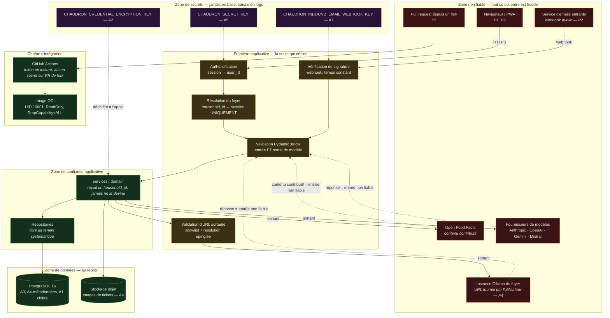

# Chaudron — modèle de menace

> Document de cadrage. Rédigé en français ; **tous les identifiants cités
> (tables, colonnes, variables d'environnement, endpoints) sont en anglais** et
> font foi tels quels.
> Statut : proposition, à relire à chaque ADR touchant une des surfaces ci-dessous.
> Compagnon : [`security-review-baseline.md`](security-review-baseline.md), qui
> audite le baseline existant plutôt que la conception.

---

## 1. Objet et portée

Ce document décrit **ce qu'on protège, contre qui, avec quoi, et ce qui reste
découvert**. Il n'est pas une checklist de bonnes pratiques : il n'énumère que
les menaces qui ont un coût concret pour une personne qui utilise Chaudron ou qui
en exploite une instance.

Il est écrit pendant la phase de cadrage, avant tout code de fonctionnalité.
C'est le seul moment où corriger une frontière de confiance coûte une
après-midi plutôt qu'une migration.

**Périmètre.** L'application Chaudron telle que conçue : backend FastAPI, PWA
React, PostgreSQL 16, conteneurs Podman rootless, CI GitHub Actions, et les
quatre dépendances externes (fournisseurs de modèles, Open Food Facts, service
de réception d'emails, instances Ollama).

**Hors périmètre.** La sécurité de l'hôte, la configuration TLS du reverse
proxy, la sécurité interne d'Open Food Facts ou d'un fournisseur de modèle, et
les attaques supposant un opérateur d'instance déjà compromis avec les droits
root. Ces exclusions sont assumées et cohérentes avec [`SECURITY.md`](../SECURITY.md).

**Hypothèses de base.**

1. L'instance est exploitée par une personne qui n'est pas une équipe sécurité.
   Tout contrôle qui exige une vigilance quotidienne échouera.
2. Le code est public (AGPL-3.0). Voir §7.
3. La phase 2 (comptes créés par des tiers) arrivera. Une conception qui n'est
   sûre qu'en phase 1 est une conception à réécrire.

---

## 2. Actifs, classés par gravité de compromission

L'ordre est celui du coût réel pour la personne lésée, pas celui de la facilité
d'exploitation.

| # | Actif | Où il vit | Ce que coûte sa compromission |
|---|---|---|---|
| **A1** | **Clés d'API des fournisseurs déposées par les foyers** | `llm_provider_config.api_key_ciphertext`, et **en clair en mémoire** à chaque appel | Secret **monétaire appartenant à un tiers**. Vol = facture chez Anthropic/OpenAI/Google/Mistral, sur un compte que Chaudron ne contrôle pas et ne peut pas plafonner. Dommage financier direct, non plafonné, et perte de confiance irrécupérable : c'est le seul actif dont le propriétaire n'est ni l'utilisateur ni l'exploitant. |
| **A2** | **`CHAUDRON_CREDENTIAL_ENCRYPTION_KEY`** | Environnement du conteneur | Déchiffre **tous** les A1 de l'instance d'un coup. C'est le point de défaillance unique de la protection au repos. |
| **A3** | **Inventaire complet d'un domicile** | `inventory_lot`, et surtout `recipe_suggestion.stock_snapshot` (JSONB, inventaire figé) | Cartographie de la consommation d'un foyer : régime, allergies, produits médicaux, alcool, produits confessionnels, présence d'enfants, budget, rythme de vie et **absences** (un stock qui cesse de bouger dit qu'il n'y a personne). Données potentiellement **sensibles au sens de l'article 9 RGPD** (santé, convictions religieuses) — voir §8. |
| **A4** | **Images de tickets de caisse** | Stockage objet, clé `receipt.image_object_key` | Où, quand, quoi, combien. Numéro de carte de fidélité, parfois 4 derniers chiffres d'une carte bancaire, parfois un nom. Une image est plus difficile à expurger qu'une ligne : ce qui est sur la photo y reste. |
| **A5** | **`CHAUDRON_SECRET_KEY`** | Environnement | Forge de sessions/JWT ⇒ usurpation de n'importe quel compte ⇒ accès à A1, A3, A4. |
| **A6** | **Identités et secrets d'authentification** | `user_account.email`, `password_hash` | Réutilisation de mot de passe hors Chaudron ; l'email seul suffit à du phishing ciblé (« votre clé Anthropic ne fonctionne plus »). |
| **A7** | **`CHAUDRON_INBOUND_EMAIL_WEBHOOK_KEY`** | Environnement | Injection d'achats arbitraires dans **n'importe quel** foyer, et point d'entrée de contenu non fiable vers un modèle (§6.6). |
| **A8** | **Mot de passe PostgreSQL / accès base** | Secret Podman, réseau `chaudron-net` | Lecture de A1 chiffrés (inexploitables seuls), A3, A4 en clair. La cascade dépend entièrement de A2 restant hors de portée. |
| **A9** | **Intégrité du stock d'un foyer** | Tables métier | Pas une fuite mais une nuisance réelle : un stock faux fait abandonner l'application. Et une **information allergène fausse a des conséquences physiques**. |
| **A10** | **Cartographie de l'infrastructure privée d'un foyer** | `llm_provider_config.base_url` (URL d'un Ollama domestique), `CHAUDRON_OLLAMA_ALLOWED_HOSTS` | Ne compromet rien seul, mais renseigne un attaquant sur le réseau interne d'un tiers. |
| **A11** | **Disponibilité et budget de l'exploitant** | Mode `instance_owner`, quota Open Food Facts | Un abus fait payer l'exploitant (A11a) ou fait bannir l'IP de l'instance par Open Food Facts, coupant le service pour tous (A11b). |

**Le classement dit une chose importante :** les trois premiers actifs
n'appartiennent pas à l'exploitant. C'est ce qui distingue Chaudron d'un outil
personnel — on garde le bien d'autrui.

---

## 3. Profils d'attaquant

Cinq profils réalistes. Chacun est décrit par ce qu'il **a déjà**, ce qu'il
**veut**, et ce qui le rend crédible ici.

### P1 — Utilisateur légitime d'un autre foyer

**A déjà :** un compte valide, une session valide, un `household_id` à lui, et
la connaissance intime du produit (il l'utilise).
**Veut :** voir l'inventaire, les tickets ou les recettes d'un autre foyer ; ou
faire payer la clé d'API d'un autre foyer.
**Crédible parce que :** c'est le seul attaquant qui n'a **rien à contourner
pour atteindre l'API**. Il lui suffit de substituer un identifiant. C'est le
profil le plus probable et celui contre lequel la conception est la plus
faible ([§6.3](#63-s3--isolation-entre-foyers)).
**Capacité :** substitution d'UUID, manipulation de paramètres, appels
concurrents, exploration de l'API à partir du code source public.

### P2 — Visiteur non authentifié

**A déjà :** l'URL de l'instance et le code source.
**Veut :** un accès quelconque — création de compte non sollicitée, lecture
d'une image de ticket par son URL, injection via le webhook email, énumération
de comptes par le formulaire de connexion ou de réinitialisation.
**Crédible parce que :** une instance auto-hébergée est exposée sur Internet
sans WAF ni fail2ban, et le webhook email est par construction un endpoint
public. C'est aussi le profil des scanners automatisés, qui trouveront
l'instance quelle que soit son obscurité.

### P3 — Opérateur d'instance malveillant ou négligent

**A déjà :** root sur l'hôte, la base, `CHAUDRON_CREDENTIAL_ENCRYPTION_KEY`.
**Veut :** les clés d'API des foyers hébergés, ou leurs données.
**Crédible parce que :** l'auto-hébergement encourage des instances partagées
entre amis, colocations ou familles élargies. **Contre lui, il n'existe aucun
contrôle technique** : l'application doit déchiffrer A1 pour appeler le
fournisseur, donc l'opérateur peut lire A1. C'est une propriété du modèle BYOK,
pas un défaut réparable.
**Conséquence de conception :** ce fait doit être **écrit dans l'interface**, au
moment où l'utilisateur colle sa clé — « l'administrateur de cette instance peut
techniquement lire cette clé ; déposez une clé dédiée et plafonnée ». Un
utilisateur informé qui accepte n'est pas une victime ; un utilisateur qui
l'ignore l'est.

### P4 — Attaquant réseau

**A déjà :** une position sur le chemin réseau, ou le contrôle d'un hôte que le
serveur Chaudron accepte de contacter (une instance Ollama, un DNS, un service de
réception d'emails).
**Veut :** pivoter vers le réseau interne de l'instance via SSRF, ou intercepter
des données en transit.
**Crédible parce que :** l'URL Ollama est **fournie par l'utilisateur et
appelée par le serveur** — c'est une primitive SSRF par construction, et le
filtrage habituel est inopérant puisque l'adresse légitime d'un Ollama
colocalisé *est* privée ([§6.2](#62-s2--ssrf-via-lurl-ollama)).

### P5 — Contributeur hostile via pull request

**A déjà :** un compte GitHub, le droit d'ouvrir une PR depuis un fork (le dépôt
est public).
**Veut :** exécuter du code sur le runner CI, exfiltrer un secret de dépôt,
empoisonner un cache, ou glisser une régression discrète (un `WHERE household_id`
retiré, une comparaison de signature non constante, une allowlist élargie « pour
le confort »).
**Crédible parce que :** le projet est maintenu par une personne seule, qui
relit à ses heures perdues, et la CI construit une image à partir d'un
`Containerfile` que la PR contrôle. Le vecteur « régression discrète » est plus
réaliste que le vecteur « exfiltration » : `CONTRIBUTING.md` §6 liste déjà les
motifs de refus correspondants, ce qui montre que le risque est identifié.

**Profil volontairement absent :** l'attaquant étatique. Hors de portée d'un
projet solo, et le mentionner dilue les cinq précédents.

---

## 4. Frontières de confiance

Une frontière est un endroit où la donnée change de propriétaire ou de niveau de
confiance. Toute donnée qui traverse une frontière entrante est **hostile par
défaut**, y compris quand elle vient d'un modèle qu'on paie.

**Trois règles se lisent directement sur ce diagramme, et aucune n'est
négociable :**

1. **`household_id` n'entre jamais par une flèche venant de la zone non fiable.**
   Ni en-tête, ni sous-domaine, ni corps, ni paramètre de chemin. Il naît de la
   session, une seule fois, à la frontière. C'est déjà un motif de refus de PR
   (`CONTRIBUTING.md` §6) ; c'est ici la raison.
2. **Les réponses des services externes rentrent par la même porte que les
   entrées utilisateur.** Un JSON produit par un modèle, une fiche Open Food
   Facts, une réponse Ollama : même validation Pydantic, mêmes bornes de taille,
   même traitement à l'affichage. Payer un fournisseur ne rend pas sa sortie
   fiable.
3. **Les secrets ne traversent jamais la frontière dans le sens sortant.** Ni
   vers le navigateur, ni vers les logs, ni vers une trace d'exception, ni vers
   une colonne de base (§6.1). La zone secrets n'a que des flèches entrantes vers
   le traitement, jamais vers la persistance.

---

## 5. Comment lire les tableaux de la section 6

Chaque surface est décrite par quatre colonnes. **La colonne « Non couvert » est
la plus importante du document.** Une menace listée comme couverte et qui ne
l'est pas est pire qu'une menace non listée : elle produit une fausse sécurité,
et personne ne la relit.

Un contrôle est dit **« retenu »** quand il est décidé, pas quand il est
implémenté. À ce stade du projet, **aucun contrôle n'est implémenté** : ce
document décrit la cible, pas l'état.

---

## 6. Surfaces

### 6.1 S1 — Clés d'API des fournisseurs déposées par les foyers

**Actifs :** A1, A2. **Attaquants :** P1, P2, P3.

Le fait structurant, énoncé sans détour dans l'ADR-0007 : *« le chiffrement au
repos ne protège pas d'une compromission applicative, puisque l'application doit
déchiffrer pour appeler »*. Le chiffrement au repos protège **un dump de base
volé**, et rien d'autre. Tout le reste du dispositif consiste à faire en sorte
que la clé, une fois déchiffrée en mémoire, n'aille nulle part.

| Menace | Impact concret | Contrôle retenu | Non couvert |
|---|---|---|---|
| Vol d'un dump PostgreSQL (sauvegarde, réplique, poubelle d'un hébergeur) | Aucun si A2 est ailleurs — le chiffré seul est inexploitable | AES-256-GCM ; clé issue de l'environnement, **jamais de la base, jamais d'une migration, jamais d'un seed** ; AAD = `(household_id, config_id)` donc un chiffré recopié sur une autre ligne ne se déchiffre pas | **Si A2 est stockée à côté du dump** — dans le même répertoire personnel, dans la même sauvegarde de `$HOME` — le contrôle est nul. Le fichier d'environnement et le dump voyagent ensemble par défaut. C'est le mode d'échec le plus probable, et il est opérationnel, pas cryptographique. |
| Lecture de la clé par un endpoint de l'API | Vol de A1 par P1 ou P2 | Aucun schéma de réponse ne contient le chiffré ni sa version déchiffrée ; seuls `provider`, `api_key_set_at` et `api_key_last4` sortent. Colonne `deferred=True` en SQLAlchemy : un `select()` ordinaire **ne charge pas** le chiffré, il faut un `undefer()` explicite, greppable et visible en revue | Un `undefer()` légitime dans le service d'appel reste un `undefer()`. Rien n'empêche un schéma Pydantic de sérialiser l'objet ORM complet si quelqu'un renvoie l'entité au lieu d'un DTO. **Le contrôle est une friction, pas une barrière.** |
| **Fuite par le canal d'erreur** | Vol de A1, en clair, persisté | Filtre de journalisation structurée ; `__repr__` masqué sur les objets de configuration ; réécriture des traces renvoyées au client | **Le schéma contredit le contrôle.** `llm_provider_config.last_error` et `receipt.parse_error` sont des colonnes `text` destinées à recevoir le message d'erreur amont, et `last_error` est affiché dans le bandeau « votre clé ne fonctionne plus ». Un fournisseur, un proxy ou un Ollama hostile qui renvoie l'en-tête `Authorization` dans son message d'erreur écrit A1 en clair en base, puis à l'écran, puis dans la sauvegarde. **Aucune redaction n'est spécifiée à l'écriture de ces colonnes.** |
| Fuite par `raw_response` | Vol de A1 si le fournisseur écho la requête | — | Non traité. `receipt.raw_response` (JSONB) reçoit la sortie brute du modèle sans borne ni filtre décrits. |
| Rotation de A2 | Impossibilité de déchiffrer, ou fenêtre d'exposition prolongée | `api_key_encryption_key_id` permet de lire l'ancien et d'écrire le nouveau, donc une migration en tâche de fond sans arrêt | **La procédure n'existe pas** : ni déclencheur, ni fréquence, ni tâche de re-chiffrement, ni comportement si l'ancienne clé a disparu de l'environnement (data-model §11 q15). Une mécanique sans procédure ne sera jamais exécutée. |
| Rotation d'une clé A1 par l'utilisateur | Ancienne clé toujours valide chez le fournisseur | Écriture idempotente, l'ancienne valeur est écrasée | Chaudron ne peut pas révoquer une clé chez Anthropic. L'interface **doit** dire « révoquez aussi l'ancienne clé dans votre console », sinon la rotation est cosmétique. |
| Opérateur d'instance (P3) | Vol de toutes les A1 de l'instance | **Aucun, et c'est irréductible** | Non couvert par construction. Traité par la transparence : l'avertissement au moment de la saisie (§3, P3), et la recommandation d'une clé dédiée avec plafond de dépense côté fournisseur. |
| Vol de A1 par accès en écriture à la base | Se réattribuer la clé d'un autre foyer | AAD lié à la ligne : le chiffré recopié ne se déchiffre pas. FK composite sur `llm_purpose_binding` : affecter la configuration d'un autre foyer est **impossible au niveau base** | Le mode `instance_owner` est verrouillé par une règle **inter-tables**, donc non exprimable en `CHECK` ; elle repose sur le service seul. |

**Conséquence pour la v1 :** la fuite par le canal d'erreur est la faille la plus
crédible de cette surface, parce qu'elle ne suppose aucun attaquant — juste un
fournisseur bavard et un développeur qui écrit `last_error = str(exc)`.

---

### 6.2 S2 — SSRF via l'URL Ollama

**Actifs :** A10, réseau interne de l'hôte. **Attaquant :** P1, P4.

Rappel du problème, correctement posé dans l'ADR-0007 : l'URL est fournie par
l'utilisateur et appelée par le serveur, et **le filtrage habituel — rejeter les
plages privées — est inopérant**, puisque l'adresse légitime d'un Ollama
colocalisé est privée. D'où l'allowlist explicite `CHAUDRON_OLLAMA_ALLOWED_HOSTS`.

C'est le bon contrôle. Mais une allowlist n'est sûre que si **l'hôte qu'on
autorise est exactement l'hôte qu'on contacte**, et c'est là que tout se joue.

| Menace | Impact concret | Contrôle retenu | Non couvert |
|---|---|---|---|
| URL vers un hôte arbitraire | Le serveur devient un proxy | Allowlist explicite par variable d'environnement ; schéma limité à `http`/`https` ; hors allowlist ⇒ refus à l'enregistrement avec message explicite | — |
| **DNS rebinding** | L'allowlist passe à la validation, l'appel touche `169.254.169.254` ou `127.0.0.1` | « Résolution DNS effectuée à la validation **et** avant l'appel » | **Le contrôle décrit ne ferme pas la fenêtre.** Résoudre deux fois laisse un TOCTOU : le client HTTP re-résout au moment de la connexion. Le seul contrôle qui tient est **résoudre puis se connecter à l'IP obtenue**, en portant le nom d'origine dans l'en-tête `Host` (et en revalidant l'IP après chaque résolution). Ce n'est écrit nulle part. |
| Notations alternatives d'adresses | Contournement d'une allowlist naïve | — | **Non traité.** `0x7f000001`, `2130706433`, `127.1`, `0.0.0.0`, `[::1]`, `[::ffff:127.0.0.1]`, `localhost.` (point final), `127.0.0.1.nip.io`. Toute comparaison de chaînes sur l'hôte est contournable ; la comparaison doit porter sur **l'IP résolue et normalisée**, pas sur le texte. |
| **Port arbitraire sur un hôte autorisé** | Scanner de ports interne : `ollama:22`, `ollama:5432`, `ollama:6379` — les temps de réponse suffisent à cartographier | `CHAUDRON_OLLAMA_ALLOWED_HOSTS` accepte « hostnames **ou** host:port » | **Non couvert si le port est optionnel.** Un hôte autorisé sans port autorise tous ses ports. Le port doit être **obligatoire** dans l'allowlist, et une entrée sans port doit signifier « port 11434 uniquement », jamais « tous ». |
| `userinfo` dans l'URL | `http://ollama@attaquant.example/` lu comme autorisé par un parseur naïf | — | **Non traité.** L'URL doit être rejetée si elle contient `@`, un caractère de contrôle, ou une séquence encodée dans la partie hôte. |
| Redirections | Un hôte autorisé redirige vers un hôte interne | Redirections désactivées | — (contrôle correct et suffisant, à condition qu'il soit vraiment posé sur le client HTTP : `httpx` suit `follow_redirects=False` par défaut, mais un `AsyncClient` partagé mal configuré l'active) |
| Métadonnées cloud | Vol de credentials IAM de l'hébergeur | Implicitement couvert par l'allowlist | Couvert **tant que l'opérateur n'élargit pas l'allowlist**. Il n'existe aucune **denylist plancher** : `169.254.0.0/16`, `::ffff:169.254.0.0/112`, `fd00:ec2::254` doivent être refusés **même si l'opérateur les autorise**. Une allowlist sans plancher fait porter la sécurité à la configuration. |
| Temps et taille de réponse | Épuisement de connexions, saturation mémoire | Délai d'attente et taille de réponse bornés (`CHAUDRON_OLLAMA_TIMEOUT_SECONDS`) | La **taille** n'a pas de variable de configuration ; seul le temps en a une. Il manque aussi une borne sur la profondeur/taille du JSON désérialisé, et un plafond de concurrence par foyer. |
| Sondage de capacités à l'enregistrement | Même primitive, déclenchée par un simple POST | « Cet appel passe par la même validation SSRF que les appels d'inférence » | Contrôle correct. À vérifier en test : c'est le chemin qu'on oublie, parce qu'il est écrit avant le client d'inférence. |

**Conséquence pour la v1 :** l'allowlist doit être un objet, pas une chaîne. Une
fonction unique `resolve_and_validate(url) -> (ip, port, host_header)` traversée
par **tous** les appels sortants vers un hôte fourni par l'utilisateur, avec des
tests contenant explicitement chaque notation ci-dessus.

---

### 6.3 S3 — Isolation entre foyers

**Actifs :** A1, A3, A4, A9. **Attaquant :** P1 — le plus probable.

C'est la surface la plus grave et la plus probable de ce produit. Un produit
multi-foyer qui fuit entre foyers n'a plus rien à défendre : A3 et A4 partent
ensemble.

Le dispositif prévu a **trois couches**, et elles n'ont pas la même solidité.

| Couche | Ce qu'elle empêche vraiment | Ce qu'elle n'empêche pas |
|---|---|---|
| **Convention applicative** (`HouseholdScope`, repository de base, `household_id` en paramètre obligatoire typé) | Les erreurs d'inattention dans le chemin nominal ; `mypy` attrape l'oubli du paramètre | **Rien** dès que quelqu'un écrit `session.execute(select(Model))` sans passer par le repository. L'ADR-0006 le reconnaît explicitement. Un paramètre obligatoire garantit qu'on *passe* un `household_id`, pas qu'on l'utilise dans le `WHERE`. |
| **FK composites** `(household_id, x_id)` → `parent(household_id, id)` | **Toute écriture** croisée : ranger un lot dans le frigo d'un autre foyer est impossible, même avec un bug, même avec un `UPDATE` manuel. Sur `llm_purpose_binding`, c'est ce qui empêche de dépenser la clé d'un autre foyer | **Toute lecture.** Une FK composite ne filtre rien : un `SELECT` sans `WHERE household_id` renvoie les lignes de tout le monde. Or la fuite qui compte ici est une fuite en lecture. |
| **RLS PostgreSQL** | Tout, en lecture comme en écriture, quel que soit le code appelant | **Non activé en v1** dans la conception actuelle. |

**Ce que la conception actuelle laisse découvert :**

| Menace | Impact concret | Contrôle retenu | Non couvert |
|---|---|---|---|
| `WHERE household_id` oublié sur un agrégat de stock | P1 voit le frigo d'une autre famille | Repository de base + revue + tests d'isolation par ressource (404, jamais 403) | Les tests d'isolation ne couvrent que les ressources **auxquelles quelqu'un a pensé**. Rien n'échoue quand on oublie d'écrire le test — c'est exactement le mode d'échec que l'ADR-0006 reproche à la migration tardive, reproduit un cran plus bas. |
| Requête « juste pour un tableau de bord » | Fuite transverse silencieuse | Revue de code | Une convention n'est appliquée qu'aux moments où un relecteur est présent. Le projet est maintenu par une personne, qui relit son propre code. |
| **Jobs de fond** (parsing de tickets, notifications de péremption, réconciliation de stock) | Fuite de A3/A4 hors de tout contexte HTTP | « Ils doivent charger le foyer depuis la ligne traitée, jamais depuis un contexte ambiant » | **Purement conventionnel, et le document lui-même dit que ce sont eux qui fuiront en premier.** L'index `ix_receipt_pending` est **délibérément transverse aux foyers** : le worker lit une file mélangée et doit se rescoper à la main sur chaque ligne. Une seule ligne traitée avec le `household_id` de la précédente suffit. |
| `product_id` cross-tenant | Référencer le produit **privé** d'un autre foyer ; exposition d'habitudes d'achat nominatives (marques, régimes, produits médicaux) dans l'autocomplétion | Applicatif uniquement : le repository ne résout un produit que dans `household_id IS NULL OR household_id = :current` | **Trou connu et assumé** (data-model §5.2) : `product.household_id` est nullable, donc inutilisable comme cible de FK composite. C'est le seul endroit du schéma où la base ne peut pas aider. |
| `instance_owner` usurpé | Un foyer tiers fait payer l'exploitant | `uq_household_instance_owner` garantit au plus un foyer propriétaire ; `DEFAULT false` | La règle « seul ce foyer peut créer une configuration en mode `instance_owner` » est **inter-tables**, donc non exprimable en `CHECK`, donc portée par le service seul. De plus, **deux sources de vérité coexistent** : `household.is_instance_owner` (base) et `CHAUDRON_INSTANCE_OWNER_HOUSEHOLD_ID` (environnement). Leur divergence est une autorisation accordée par erreur. |
| Clé de stockage objet devinable | Lecture d'une image de ticket sans passer par l'API | Clé **préfixée par `household_id`** + URL signée | Le préfixe ne protège pas si le bucket est listable ou si l'URL signée n'expire pas. Voir §6.5. |

#### Recommandation : exiger le RLS dès la v1

**Position : oui, le Row-Level Security PostgreSQL doit être exigé en v1.** La
discipline conventionnelle ne suffit pas ici, et l'argument qui justifie de la
différer ne tient pas pour la pile choisie.

*Pourquoi la convention ne suffit pas.* Les FK composites ferment la classe des
écritures croisées — c'est un vrai gain, obtenu à bas coût. Mais la fuite qui
détruit ce produit est **une lecture sans filtre**, et aucune des deux premières
couches ne l'empêche. Restent la revue (un relecteur, qui est l'auteur) et les
tests d'isolation (écrits par la même personne, pour les ressources auxquelles
elle a pensé). Ce n'est pas un filet, c'est la même main qui tient les deux bouts.

*Pourquoi l'argument de report ne tient pas.* Le report est motivé par le
pooling : `SET LOCAL` imposerait un pooling en mode transaction, et se tromper
produirait une fuite inverse — une connexion recyclée qui garde le foyer
précédent. Le raisonnement est juste **en présence d'un pooler externe**
(PgBouncer en mode session ou statement). Or la pile retenue est SQLAlchemy 2.x
asynchrone + `asyncpg`, avec un pool **en processus** qui réserve une connexion
pour la durée d'une transaction, et `SET LOCAL` est réinitialisé par PostgreSQL
lui-même au `COMMIT`/`ROLLBACK`. Le mode d'échec redouté suppose soit un `SET`
de session au lieu d'un `SET LOCAL`, soit un composant que Chaudron n'a pas
choisi. **Le coût invoqué est celui d'une architecture qui n'est pas la
sienne.**

*Ce qu'il reste vraiment à payer.* Une discipline « une requête HTTP = une
transaction ». Elle est **déjà** listée comme prérequis à payer immédiatement.
Une fois payée, le delta jusqu'au RLS est une migration.

*Ce que le RLS apporte que rien d'autre n'apporte.* Il déplace la garantie de la
convention vers le moteur, et il couvre le seul endroit où il n'y a **aucun
relecteur à l'exécution** : les jobs de fond. Une politique refuse la ligne ;
elle ne compte pas sur le développeur pour s'en souvenir à 23 h.

*Le déclencheur actuel est inutilisable.* « Le jour où un compte est créé par
une personne extérieure au cercle familial » n'est pas un événement observable
par la CI ni par un test. Il sera franchi un soir, par commodité, et personne ne
s'en apercevra. Un déclencheur qui repose sur la mémoire de l'exploitant n'est
pas un déclencheur.

*Et le coût aujourd'hui est nul.* Il n'y a **aucun code de fonctionnalité**.
Chaque heure de rétrofit que l'ADR-0006 redoute est une heure qui n'a pas encore
été dépensée. C'est précisément l'argument de l'ADR-0006 lui-même, appliqué à sa
propre conclusion.

**Forme concrète recommandée pour la v1 :**

1. Rôle applicatif `chaudron_app`, **non propriétaire** des tables, plus
   `ALTER TABLE … FORCE ROW LEVEL SECURITY` (le propriétaire contourne RLS sans
   ça).
2. `SET LOCAL app.household_id = …` émis par un point unique — la fabrique de
   session — dans la transaction, jamais dispersé dans les services.
3. Politiques `USING` **et** `WITH CHECK` identiques :
   `household_id = current_setting('app.household_id', true)::uuid`.
4. Un rôle `chaudron_worker` distinct pour la file transverse, avec une vue ou une
   fonction `SECURITY DEFINER` exposant **uniquement** `(id, household_id)` des
   tickets en attente ; le traitement réel se fait après avoir posé le tenant.
   L'index `ix_receipt_pending` reste transverse, mais il ne donne plus accès aux
   données.
5. **Conserver la couche applicative** : le RLS est une seconde barrière, pas un
   remplacement. Un filtre applicatif absent donne une requête lente, pas une
   requête fausse.
6. **Conserver les tests d'isolation** : ils vérifient désormais que le
   comportement est bien 404 et non une erreur de politique.

*Ce que le RLS ne couvre toujours pas, et qu'il faut écrire :* le stockage objet
(§6.5) n'est pas dans PostgreSQL et ne connaît aucune politique ; le trou
`product_id` reste applicatif ; et un `current_setting` mal posé — donc absent —
doit faire **échouer** la requête, pas la laisser passer (d'où le rôle non
propriétaire et `FORCE`).

---

### 6.4 S4 — Webhook de réception d'emails entrants

**Actifs :** A7, A9, A3. **Attaquant :** P2.

C'est le seul endpoint de Chaudron conçu pour être appelé par un inconnu. Sans
vérification de signature, n'importe qui injecte des achats dans n'importe quel
foyer — et surtout, injecte du **texte contrôlé par l'attaquant dans le chemin
qui va vers un modèle** (§6.6).

**La note de conception correspondante (`docs/technical-notes-ingestion.md`) est
référencée mais n'existe pas.** C'est, aujourd'hui, la surface sensible la plus
sous-spécifiée du projet.

| Menace | Impact concret | Contrôle retenu | Non couvert |
|---|---|---|---|
| Webhook non signé | Injection d'achats arbitraires dans n'importe quel foyer | Signature vérifiée avec `CHAUDRON_INBOUND_EMAIL_WEBHOOK_KEY` | L'algorithme n'est pas spécifié. Une comparaison avec `==` est vulnérable au timing ; `hmac.compare_digest` est obligatoire. À écrire, pas à supposer. |
| **Rejeu** | Un webhook légitime capturé est renvoyé N fois | — | **Non traité.** Il faut un horodatage signé, une fenêtre de tolérance courte, et un cache d'identifiants de message déjà vus. La signature seule ne protège pas du rejeu. |
| Clé unique pour toute l'instance | Sa fuite compromet **tous** les foyers d'un coup | Secret Podman | Pas de rotation possible sans coupure, pas de portée par foyer. Acceptable pour un prestataire unique, à condition que ce soit écrit. |
| **Devinabilité de l'adresse de destination** | Un tiers qui devine `foyer-dupont@receipts.example.org` injecte dans ce foyer, même sans la clé si un jour un chemin non signé existe | Rattachement du foyer **par l'adresse de destination** | **Non traité, et c'est le point le plus grave de cette surface.** L'adresse est le seul lien entre un email et un foyer : c'est donc, de fait, un **secret d'autorisation**. Si elle dérive du nom du foyer ou d'un compteur, elle est devinable et énumérable. Elle doit être un **jeton aléatoire d'au moins 128 bits** (`r7k2m9x4q1w8@…`), révocable, régénérable, et **aucune colonne du modèle de données ne la porte aujourd'hui**. |
| Énumération des foyers | Cartographie des foyers de l'instance | — | **Non traité.** Le webhook doit répondre **identiquement** (même code, même délai) pour une adresse inconnue et pour une adresse connue. Sinon il devient un oracle d'existence de foyer. |
| Usurpation de l'expéditeur | Un tiers envoie un faux récapitulatif à l'adresse d'un foyer | — | **Non traité.** Même avec un webhook signé par le prestataire, l'email qu'il relaie peut venir de n'importe qui. Il faut soit une allowlist d'expéditeurs par foyer, soit un statut « non vérifié » visible dans l'écran de revue. Le contrôle de fond reste la revue humaine (§6.6). |
| Pièces jointes hostiles | Déni de service, traversée de chemin, parsing MIME dangereux | `CHAUDRON_INBOUND_EMAIL_MAX_BYTES` | La borne de taille ne dit rien du **nombre** de pièces jointes, des archives imbriquées, ni du nom de fichier. **Le nom de fichier fourni ne doit jamais servir à construire un chemin** : la clé de stockage est dérivée de `(household_id, uuid)`, jamais du nom reçu. Le type MIME doit être déterminé par inspection du contenu, pas par l'en-tête. |
| Bombe de décompression / image | Épuisement mémoire du worker | — | **Non traité.** Les dimensions de l'image doivent être bornées avant décodage, pas après. |

---

### 6.5 S5 — Images de tickets et données personnelles

**Actifs :** A3, A4. **Attaquants :** P1, P2, P3.

| Menace | Impact concret | Contrôle retenu | Non couvert |
|---|---|---|---|
| Accès inter-foyer à une image | Lecture de A4 par P1 | Clé d'objet **préfixée par `household_id`** ; service par URL signée ; ligne `receipt` filtrée par tenant | Le préfixe empêche la **devinette**, pas l'**énumération** si le bucket est listable. La durée de validité de l'URL signée n'est pas définie ; une URL longue durée transmise dans un `Referer` ou un historique de navigateur est une fuite persistante. |
| Accès non authentifié | Lecture de A4 par P2 | Idem | Une image servie directement par le reverse proxy depuis un répertoire, sans passer par l'API, court-circuite tout. Le volume `%h/chaudron/data/uploads` est un répertoire de fichiers : rien n'empêche de le publier par erreur. |
| **Rétention** | Une photo de ticket vit indéfiniment | — | **Non tranché** (data-model §11 q5). L'architecture recommande « purge après traitement à privilégier », le modèle de données ne porte **aucune colonne** pour la suivre. Sans colonne, il n'y a pas de purge : il y a une intention. |
| Contenu résiduel après suppression | L'image reste alors que la ligne est partie | `ON DELETE CASCADE` depuis `household` | **Le CASCADE ne touche que PostgreSQL.** Supprimer un foyer efface les lignes et laisse les objets. Une suppression RGPD partielle est une non-conformité qui a l'air d'une conformité. |
| **EXIF** | Géolocalisation du domicile republiée avec l'image | — | **Non traité.** Les métadonnées EXIF (GPS, modèle d'appareil, horodatage) doivent être supprimées **à l'ingestion**, avant écriture. |
| Type de contenu au service | XSS stocké si une image est servie en `text/html` | — | **Non traité.** `Content-Type` déterminé par inspection, `Content-Disposition: attachment` ou domaine séparé, `X-Content-Type-Options: nosniff`. |
| Données bancaires partielles | Fragments de PAN, carte de fidélité | Revue humaine | Ces fragments **restent dans l'image** et dans `receipt.raw_response`. On ne les enlève pas ; on limite leur durée de vie (§8). |
| `stock_snapshot` | Inventaire complet d'un domicile, en JSONB, indéfiniment | — | **Non tranché.** C'est, de l'aveu du modèle de données, « la donnée la plus sensible de la base ». Elle n'a ni durée de vie, ni chiffrement applicatif, ni motif de conservation borné. |
| Transmission au modèle | A3/A4 partent chez un tiers | BYOK : le foyer choisit son fournisseur, et donc sa juridiction (Mistral UE, ou Ollama et rien ne sort) | Le **choix** est offert ; le **consentement éclairé** ne l'est pas encore. L'utilisateur doit voir, avant l'envoi, quoi part et vers qui. Voir §8. |

---

### 6.6 S6 — La sortie de modèle est une entrée non fiable

**Actifs :** A9 (intégrité), et indirectement A3. **Attaquants :** P1, P2 via un
contenu qu'ils contrôlent.

Le principe est déjà posé — *« un JSON produit par un LLM passe par la même
validation qu'un formulaire posté par un inconnu »*. Ce qui manque, c'est la
prise en compte du fait que **le contenu injecté n'est pas produit par le
modèle : il est transporté par lui**.

Deux vecteurs d'entrée que Chaudron accepte par conception :

- **L'image d'un ticket**, qui peut porter du texte imprimé par un attaquant
  (une étiquette collée, un faux ticket photographié) ;
- **Le corps d'un email transféré**, entièrement contrôlé par l'expéditeur.

| Menace | Impact concret | Contrôle retenu | Non couvert |
|---|---|---|---|
| Injection de prompt via un ticket ou un email | Le modèle produit des lignes inventées, ou ignore ses instructions | Schéma de sortie strict + **revue humaine obligatoire avant écriture en stock** | La revue humaine est le contrôle réel, et il est bon. Mais elle protège l'**écriture**, pas l'**affichage** : le texte injecté est affiché à l'utilisateur avant qu'il ne décide. |
| Sortie contenant du HTML/JS | XSS stocké dans l'écran de revue ou la recette | Validation Pydantic | La validation vérifie la **forme**, pas l'innocuité du contenu. Le front doit rendre tout champ issu d'un modèle en **texte pur**, jamais en HTML, jamais en Markdown avec liens actifs. Une CSP stricte, sans `unsafe-inline`, est le second filet. |
| Sortie contenant une URL ou une image distante | Exfiltration passive : un `` rendu appelle l'attaquant depuis le navigateur de la victime | — | **Non traité.** Aucune ressource distante ne doit être chargée depuis un contenu produit par un modèle. |
| **Fausse information allergène** | **Conséquence physique** | « Ne jamais présenter une information allergène issue d'un modèle comme faisant autorité » | Il n'existe pas de mécanisme. Une phrase dans un document ne survit pas à l'écran de recette. Il faut un contrôle produit explicite : les allergènes viennent d'Open Food Facts ou de la saisie, jamais du modèle, et la recette porte un avertissement non désactivable. |
| Quantités aberrantes | Stock faussé, gaspillage mesuré à tort | Bornes de schéma | À expliciter : les bornes numériques (`> 0`, plafonds réalistes) doivent être dans le schéma Pydantic, pas seulement dans les `CHECK` de la base — sinon l'erreur remonte en 500 au lieu d'un refus propre. |
| Réponse démesurée | Saturation mémoire, coût | `CHAUDRON_LLM_MAX_TOKENS` | Ne borne que la sortie demandée, pas la réponse effectivement reçue d'un endpoint hostile (cas Ollama, §6.2). |
| **Contenu contributif d'Open Food Facts** | Même classe, oubliée | — | **Non traité.** `product.name`, `brand`, `image_url` et `off_payload` sont **rédigés par des contributeurs anonymes** et stockés bruts. C'est exactement le même risque de rendu que la sortie de modèle, sur un chemin qu'on ne surveille pas parce qu'il n'a pas l'air d'être de l'IA. `image_url` est en outre une URL tierce qu'il ne faut pas charger directement depuis le client. |

**Règle générale à retenir :** une sortie de modèle ne doit **jamais** déclencher
d'action. Elle propose ; un humain décide ; le code écrit. Aucun champ produit
par un modèle ne doit servir de clé de recherche non échappée, de chemin de
fichier, d'URL appelée, ou d'argument de commande.

---

### 6.7 S7 — Authentification, sessions et CORS

**Actifs :** A5, A6, et par conséquence tous les autres. **Attaquants :** P1, P2.

La stratégie d'authentification n'est pas tranchée (`architecture.md` §8). Ce
qui suit décrit les contraintes que la décision devra respecter.

| Menace | Impact concret | Contrôle retenu | Non couvert |
|---|---|---|---|
| Vol de session | Accès total à un foyer | Configuration validée au démarrage, arrêt si incomplète | Ni le mode de transport (cookie `Secure`/`HttpOnly`/`SameSite` vs jeton en mémoire), ni la révocation, ni la durée ne sont décidés. Un JWT sans liste de révocation ne se retire pas avant expiration. |
| **Confusion d'algorithme JWT** | Forge de jetons | — | `CHAUDRON_JWT_ALGORITHM` est **une variable d'environnement**. Rendre l'algorithme configurable ouvre `none` et la confusion HMAC/RSA. L'algorithme doit être une constante du code, et la vérification doit imposer une liste d'algorithmes acceptés. |
| Réutilisation de secret | Une fuite compromet deux fonctions | — | `CHAUDRON_SECRET_KEY` sert à la fois aux sessions et aux JWT. Deux usages, deux clés, dérivées si besoin. |
| **Force brute / bourrage d'identifiants** | Prise de contrôle d'un compte | — | **Non traité nulle part.** Aucune limitation de débit n'est conçue : ni sur la connexion, ni sur le webhook, ni sur l'upload de ticket, ni sur la génération de recette (qui coûte de l'argent). Sur une instance auto-hébergée sans WAF, c'est l'attaque de P2 par défaut. |
| Énumération de comptes | Cartographie des utilisateurs | — | Non traité. Réponses et délais identiques pour un email connu et inconnu, à la connexion comme à la réinitialisation. |
| Hachage de mot de passe | Cassage hors ligne après vol de base | `password_hash` est `text`, nullable | L'algorithme n'est **pas décidé** et aucune dépendance n'est présente. Ce doit être **Argon2id**, paramétré, avec re-hachage à la connexion quand les paramètres évoluent. |
| **CORS trop permissif** | Vol de données inter-origine | `CHAUDRON_CORS_ORIGINS` en liste explicite | `CHAUDRON_CORS_ALLOW_CREDENTIALS` existe sans garde-fou documenté. L'association `*` + `credentials: true` doit **empêcher le démarrage**, pas produire un avertissement. Aucune origine ne doit être reflétée depuis l'en-tête `Origin`. |
| Rôles | Un `viewer` écrit | `membership_role` : `owner` / `member` / `viewer` | Aucune matrice permission × ressource n'existe. Sans elle, le rôle est décoratif. Un `member` peut-il déposer une clé d'API pour le foyer ? Question ouverte à conséquence financière. |

---

### 6.8 S8 — Chaîne de conteneurs et exploitation

**Actifs :** A2, A5, A7, A8. **Attaquants :** P2 après compromission applicative, P3.

Le baseline est ici **bon** — c'est la partie la plus solide du projet. Les
manques sont des angles, pas des trous.

| Menace | Impact concret | Contrôle retenu | Non couvert |
|---|---|---|---|
| Évasion / escalade dans le conteneur | Compromission de l'hôte | Podman **rootless** ; `USER chaudron` (UID 10001 fixe) ; `NoNewPrivileges=true` ; `DropCapability=ALL` ; `ReadOnly=true` ; `Tmpfs` explicite | La base de données conserve `AddCapability=CHOWN,DAC_OVERRIDE,FOWNER,SETGID,SETUID` — nécessaire à l'entrypoint `postgres`, mais `DAC_OVERRIDE` est large. Une image `postgres` préparée avec les bons UID s'en passerait. |
| Accès disque par un autre conteneur | Lecture de A4 et de la base | SELinux **Enforcing** ; `:Z` (label privé) sur chaque bind mount, avec la justification écrite ; interdiction explicite de `setenforce 0` ; piège `:U` documenté | — (traitement exemplaire) |
| Exposition réseau | Base ou API atteignable depuis Internet | API sur `127.0.0.1:8000` uniquement ; base **jamais publiée**, jointe par le réseau `chaudron-net` | Le `README.md` de premier niveau propose une commande de démarrage rapide qui publie PostgreSQL sur **toutes** les interfaces. C'est le bloc le plus copié-collé d'un dépôt public. |
| Fuite de secret par la configuration | A2, A5, A7 en clair sur disque | Secrets Podman (`type=env`), saisie masquée, transmission par stdin, `unset` final, piège du saut de ligne documenté | **`CHAUDRON_CREDENTIAL_ENCRYPTION_KEY` (A2) n'est déclarée par aucun `Secret=`.** En suivant la documentation, l'opérateur la place dans le fichier `EnvironmentFile`, en clair, dans le même répertoire personnel que les sauvegardes de la base — ce qui annule le bénéfice décrit en §6.1. Idem pour les clés OpenAI, Gemini et Mistral. |
| Image compromise en amont | Exécution de code arbitraire | Images en deux étages, sans chaîne de compilation ni `uv` au runtime | Les images de base sont épinglées par **tag**, pas par **digest**. `AutoUpdate=registry` sur `docker.io/library/postgres:16` fait de surcroît **tirer automatiquement** une nouvelle image de base de données, sans revue et sans fenêtre de maintenance. |
| Sauvegardes | Vol de A3, A4, A1 chiffrés | `pg_dump --format=custom`, restauration vérifiée avant migration destructrice | Les dumps ne sont ni chiffrés, ni gérés en rétention, et la commande documentée les écrit dans le répertoire courant — qui peut être le dépôt git. Le fichier de sauvegarde d'une instance et A2 vivent dans le même `$HOME`. |

---

### 6.9 S9 — Chaîne d'approvisionnement et intégration continue

**Actifs :** intégrité du code, A5/A7 en tant que secrets de dépôt. **Attaquant :** P5.

| Menace | Impact concret | Contrôle retenu | Non couvert |
|---|---|---|---|
| **`pull_request_target`** | Exécution de code d'un fork avec les secrets du dépôt | **Le piège est évité** : le déclencheur est `pull_request`, et il n'y a ni `workflow_run` ni `pull_request_target` | — (à re-vérifier à chaque modification du workflow : c'est la régression classique) |
| Jeton CI trop permissif | Écriture sur le dépôt depuis un job | `permissions: contents: read` au niveau du workflow | Aucun job ne réduit davantage ses permissions. `contents: read` est déjà correct pour tous. |
| Action tierce compromise | Exécution arbitraire dans le runner | Versions majeures épinglées (`@v5`, `@v7`, `@v2`) | Un **tag est mutable**. `astral-sh/setup-uv@v7` et `gitleaks/gitleaks-action@v2` sont des actions tierces : leur épinglage par SHA complet est le seul qui protège d'un déplacement de tag. |
| **Exécution de code non fiable sur PR de fork** | Minage, exfiltration de ce qui est joignable depuis le runner | Jeton en lecture seule et **aucun secret** exposé aux PR de fork (comportement GitHub par défaut) | Le job de construction exécute `podman build` sur un `Containerfile` **contrôlé par la PR** : les instructions `RUN` s'exécutent. L'impact est borné par l'absence de secret, mais ce n'est pas nul. Le paramètre « Require approval for all outside collaborators » doit être activé. |
| Fuite de secret en clair dans les logs | Rotation d'urgence | `gitleaks` sur l'historique complet (`fetch-depth: 0`) ; `pip-audit --strict` sur les dépendances verrouillées ; obligations écrites dans `CONTRIBUTING.md` §4.9 et `SECURITY.md` | Les deux jobs de sécurité ne sont ni chaînés ni déclarés obligatoires ; rien ne documente la protection de branche ni les vérifications requises. Un scan qui peut être fusionné en échec ne protège pas. |
| Vulnérabilité publiée après la fusion | Une CVE dort jusqu'à la prochaine PR | `pip-audit` sur `push` et `pull_request` | Aucune exécution **planifiée**, et pas de `dependabot.yml`. Sur un projet à faible fréquence de commits, c'est plusieurs mois d'angle mort. |
| Dépendance hostile | Exécution à l'installation | Versions **exactement** épinglées + `uv.lock` + `UV_FROZEN` + revue d'ajout documentée | Pas de vérification d'attestation ni de SBOM. Proportionné à ce stade ; à réévaluer si le projet publie des images. |
| Régression d'étanchéité glissée en revue | Fuite inter-foyer | Tests d'isolation obligatoires par ressource ; motifs de refus explicites dans `CONTRIBUTING.md` §6 | Une convention appliquée par un mainteneur unique. C'est un argument de plus pour le RLS (§6.3) : une politique de base ne se laisse pas convaincre en revue. |

---

### 6.10 S10 — Disponibilité et abus de ressources

**Actifs :** A11. **Attaquants :** P1, P2.

| Menace | Impact concret | Contrôle retenu | Non couvert |
|---|---|---|---|
| Abus du mode `instance_owner` | L'exploitant paie pour un tiers | Mode **verrouillé par défaut** ; réservé à un foyer unique garanti par index unique ; `CHAUDRON_LLM_MONTHLY_BUDGET_USD` | Aucun quota par foyer, aucune limite de débit sur la génération. Le plafond mensuel est global : atteint, il coupe la fonction pour tout le monde. |
| Bannissement d'IP par Open Food Facts | **Coupure du service pour tous les foyers** | Cache PostgreSQL global, TTL long en *stale-while-revalidate*, cache négatif court, client unique avec limiteur à 10 req/min sous le plafond de 15, tolérance aux réponses HTML | Le plafond est **global à l'instance** : un seul foyer qui scanne en rafale peut faire bannir l'instance entière. L'import du dump est identifié comme prérequis de la phase 2, pas comme contrôle de la v1. |
| Saturation du disque | Arrêt de l'instance | `CHAUDRON_INBOUND_EMAIL_MAX_BYTES` ; `Tmpfs=/tmp:rw,size=64M` | Aucune borne sur la taille d'un upload HTTP de ticket, ni sur le volume total par foyer. `python-multipart` déverse sur disque au-delà d'un seuil : 64 Mo de `tmpfs` face à un upload non borné est un arrêt, pas une protection. |
| Requête coûteuse | Épuisement du pool | Index partiels bien choisis, requêtes chaudes identifiées | Pas de pagination obligatoire décrite sur les listes (`stock_movement`, `receipt_line`). |

---

## 7. Ce que l'AGPL et le dépôt public changent

**Le code est lisible par l'attaquant. Ce n'est pas une faiblesse — c'est une
contrainte de conception qui invalide une catégorie entière de faux contrôles.**

Ce qui change vraiment :

1. **Toute sécurité par obscurité vaut zéro, et il faut le vérifier
   explicitement.** Un attaquant connaît le format des identifiants (UUIDv7,
   donc ordonnés dans le temps), le schéma des clés de stockage objet, la logique
   de validation de l'allowlist SSRF, l'algorithme de signature du webhook, la
   liste des endpoints et le nom des variables d'environnement. Le seul élément
   qui doit rester secret est **une valeur**, jamais un mécanisme : `CHAUDRON_SECRET_KEY`,
   `CHAUDRON_CREDENTIAL_ENCRYPTION_KEY`, `CHAUDRON_INBOUND_EMAIL_WEBHOOK_KEY`, les
   mots de passe, et **l'adresse email entrante d'un foyer** (§6.4) — qui doit
   donc être aléatoire, parce que le dépôt public dira exactement comment elle
   est construite.

2. **UUIDv7 est ordonné dans le temps, et le dépôt le dit.** Un identifiant
   exposé révèle son instant de création à la milliseconde. Ce n'est pas une
   faille, mais deux identifiants suffisent à estimer un volume d'activité, et un
   identifiant permet de déduire quand une personne a fait ses courses. Ne pas
   exposer d'identifiant là où un opaque suffirait, et ne jamais présumer qu'un
   UUID est un secret.

3. **La fenêtre entre une correction et son déploiement est publique.** Un commit
   `fix(auth): …` sur un dépôt public est une annonce de vulnérabilité pour toutes
   les instances non mises à jour. C'est le prix de l'ouverture, et il se paie par
   des avis de sécurité GitHub coordonnés plutôt que par des messages de commit
   discrets — le processus est déjà décrit dans `SECURITY.md`.

4. **L'attaquant peut lire les documents de conception, dont celui-ci.** La
   colonne « Non couvert » de la §6 est une feuille de route pour P1 et P2. C'est
   assumé : la publier accélère les correctifs plus qu'elle n'accélère les
   attaques, et un attaquant sérieux trouve ces trous par lecture du code de toute
   façon. La conséquence est que **cette colonne doit être vidée, pas cachée**.

5. **La CI est publique, ses logs aussi.** Tout ce qu'un job affiche est
   consultable par le monde entier, y compris les valeurs d'environnement
   imprimées par erreur. Les identifiants de la base de test dans le workflow
   sont éphémères, mais l'habitude d'y écrire des valeurs en clair est le vrai
   risque.

6. **Ce que l'AGPL ajoute, spécifiquement.** L'article 13 impose à quiconque
   exploite un Chaudron **modifié** comme service réseau d'en offrir les sources à
   ses utilisateurs. Conséquence de sécurité concrète : une instance tierce
   modifiée qui refuse ses sources est un signal — l'utilisateur ne peut pas
   vérifier ce que fait le code qui détient sa clé d'API (A1) et son inventaire
   (A3). L'AGPL ne protège pas techniquement contre P3, mais elle donne à la
   victime le droit d'auditer. Le rappeler dans l'interface est le complément
   naturel de l'avertissement décrit en §3, P3.

7. **Les contributions deviennent une surface (P5).** Elle est déjà traitée
   (§6.9), et la liste des motifs de refus de `CONTRIBUTING.md` §6 en est le
   contrôle principal. Un dépôt privé n'aurait pas cette surface ; c'est le seul
   coût de sécurité réel de l'ouverture, et il est largement compensé par la
   relecture externe — qui est, pour un projet solo, le seul mécanisme de revue
   qui ne soit pas l'auteur lui-même.

---

## 8. RGPD

Chaudron est un **logiciel**, pas un service. Le responsable de traitement est
**l'exploitant de l'instance**, jamais le projet. Cette section ne le décharge
de rien : elle lui donne ce dont il a besoin pour tenir ses obligations, et
liste ce que le logiciel doit fournir pour que ce soit possible.

### 8.1 Catégories de données traitées

| Catégorie | Où | Sensibilité |
|---|---|---|
| Identité | `user_account.email`, `display_name` | Données ordinaires. |
| Authentification | `password_hash`, `last_login_at` | Ordinaires, à protéger fortement. |
| **Consommation alimentaire** | `inventory_lot`, `stock_movement`, `receipt_line`, `stock_snapshot` | Ordinaires **en apparence**. Voir 8.2. |
| Achats | `receipt` (commerçant, date, montant, devise), images | Ordinaires, mais fortement révélatrices par agrégation. |
| **Images de tickets** | Stockage objet | Contiennent des données non maîtrisées : carte de fidélité, parfois nom, parfois fragments bancaires. |
| Techniques | Journaux avec `household_id` et identifiant de requête, adresses IP au niveau du reverse proxy | Ordinaires, durée courte. |
| Secrets de tiers | `api_key_ciphertext` | Pas des données personnelles, mais des secrets d'autrui — obligation de sécurité identique. |

### 8.2 Le point à ne pas éluder : l'article 9

Un inventaire alimentaire n'est pas une donnée neutre. Des produits sans gluten
répétés révèlent une maladie cœliaque ; des produits halal ou casher révèlent une
conviction religieuse ; des compléments ou des substituts révèlent un état de
santé ; l'alcool, le tabac, les produits infantiles révèlent un mode de vie et
une composition de foyer.

Chaudron ne collecte **pas** ces données comme telles, et n'en déduit rien. Mais
`recipe_suggestion.stock_snapshot` est **l'inventaire complet d'un domicile,
figé et conservé**, et il est envoyé à un fournisseur de modèle. Il faut donc :

- le traiter au niveau de protection de l'article 9, même si sa qualification
  juridique est discutable ;
- lui donner **la durée de rétention la plus courte du système** ;
- ne jamais l'exposer dans une interface d'administration transverse.

### 8.3 Bases légales

| Traitement | Base légale | Remarque |
|---|---|---|
| Compte, stock, listes, tickets | **Exécution du contrat** (art. 6.1.b) — c'est le service demandé | Sans ces données, il n'y a pas de produit. |
| Journaux techniques, sécurité | **Intérêt légitime** (art. 6.1.f) | Durée courte, finalité limitée à l'exploitation. |
| **Envoi à un fournisseur de modèle externe** | **Consentement** (art. 6.1.a), explicite, par foyer, révocable | C'est une transmission à un tiers, souvent hors UE. Elle doit être **opt-in**, jamais un défaut. Le mode `ollama` doit rester pleinement fonctionnel sans ce consentement. |
| Cache produit Open Food Facts | Sans objet | Aucune donnée personnelle : c'est un référentiel externe partagé. C'est aussi pourquoi il n'a **pas** de `household_id`. |

**Transferts hors UE.** Anthropic, OpenAI et Google traitent aux États-Unis :
transfert au titre du chapitre V, à couvrir par le mécanisme applicable au
fournisseur. **Mistral (UE) et Ollama (local) sont les deux configurations sans
transfert** — c'est déjà présenté comme un critère de choix affiché dans
l'interface, et c'est aussi la réponse RGPD la plus simple pour un exploitant
européen.

**Le BYOK réduit l'exposition mais ne l'annule pas.** L'ADR-0007 note à juste
titre que chaque foyer contracte directement avec son fournisseur. Mais c'est
**le serveur de l'exploitant** qui construit et émet la requête : il reste dans
la chaîne, et il doit donc informer et recueillir le consentement.

### 8.4 Durées de rétention — à définir avant le premier compte tiers

Aucune n'est fixée aujourd'hui. Ce sont des propositions à arbitrer, pas des
décisions. Chacune suppose une **colonne et une tâche**, sans quoi elle n'existe
pas.

| Donnée | Proposition | Justification |
|---|---|---|
| Image de ticket | **Purge dès la confirmation** de la revue, ou 30 jours maximum | Après revue, elle ne sert plus qu'à contester ; les lignes extraites suffisent. C'est la donnée la plus lourde et la plus sensible. |
| `receipt.raw_response` | 90 jours | Utile au débogage d'un pipeline non déterministe, inutile au-delà. |
| `recipe_suggestion.stock_snapshot` | **30 jours** | Sert à expliquer une suggestion récente. Un inventaire de domicile vieux d'un an ne sert à personne et pèse lourd en cas de fuite. |
| `receipt_line.raw_label` | Conservation longue **après anonymisation du lien au foyer** | C'est le corpus d'amélioration du rapprochement ; il n'a pas besoin d'un `household_id`. |
| `stock_movement` | 24 mois | Statistiques de gaspillage annuelles ; au-delà, agréger. |
| Journaux applicatifs | 30 jours | Diagnostic et sécurité. |
| Compte supprimé | Effacement immédiat et **total**, base **et** stockage objet | Voir 8.5. |

### 8.5 Droits des personnes, et ce que le logiciel doit fournir

| Droit | Ce qu'il faut construire | État |
|---|---|---|
| Accès et portabilité (art. 15, 20) | Un export complet d'un foyer dans un format ouvert : stock, mouvements, tickets, images, suggestions | À construire. Rien n'existe. |
| **Effacement (art. 17)** | Suppression d'un foyer **et** de ses objets | `ON DELETE CASCADE` depuis `household` couvre PostgreSQL de façon totale et atomique — c'est bien vu et explicitement motivé. **Mais le CASCADE ne supprime aucune image du stockage objet.** Un effacement partiel présenté comme complet est une non-conformité. Il faut une opération applicative qui supprime les objets **avant** de supprimer la ligne, et qui est vérifiée. |
| Rectification (art. 16) | Correction des lignes et des fiches ; la correction locale prime sur une resynchronisation externe | Prévu côté produit, à porter dans le schéma. |
| Opposition / retrait du consentement | Désactiver l'envoi au fournisseur externe sans casser le reste de l'application | Acquis par conception : les fonctions de modèle sont optionnelles et le reste de Chaudron fonctionne sans. |
| Le membre qui part | Que devient un foyer dont le dernier membre s'en va ? | **Non tranché.** Le `CASCADE` répond techniquement, pas juridiquement : les données d'un foyer appartiennent à plusieurs personnes, et le départ de l'une ne doit pas effacer celles des autres — ni les conserver indéfiniment. |
| Information | Une politique de confidentialité type, fournie avec le logiciel, que l'exploitant adapte | À écrire. Un logiciel auto-hébergeable qui n'en fournit pas laisse chaque exploitant en produire une fausse. |

### 8.6 Violation de données

L'exploitant doit notifier sous 72 heures. Pour que ce soit possible, Chaudron doit
**journaliser les accès aux actifs sensibles** : lecture d'un chiffré de clé,
export d'un foyer, suppression d'un foyer, changement de configuration de
fournisseur. Aucune table d'audit n'existe aujourd'hui. Sans elle, l'exploitant
ne peut ni délimiter une violation ni prouver qu'il n'y en a pas eu.

---

## 9. Ce que ce modèle n'a pas traité

Par honnêteté, et pour que la prochaine relecture sache par où reprendre :

- **La topologie Ollama « navigateur »** (cas B) est hors v1. Elle rouvrira toute
  la §6.2 sous un angle différent : le prompt devient public, et le backend
  validera une réponse dont il ne contrôle pas du tout la provenance.
- **La PWA elle-même** : service worker, cache hors ligne, IndexedDB contenant un
  inventaire sur un appareil partagé ou perdu. C'est un actif de type A3 sur un
  support non maîtrisé, et il n'est pas analysé ici.
- **La synchronisation hors ligne** : des identifiants générés côté client
  (UUIDv7) et rejoués à la reconnexion demandent une validation d'appartenance
  côté serveur qui n'est pas décrite.
- **Le mode d'authentification externe (OIDC)**, évoqué pour la phase 2.
- **La gouvernance du catalogue public** : qui peut corriger un `product`
  partagé, et ce qu'un contributeur hostile peut y écrire pour tous les foyers.

---

## 10. Révision

Ce document est relu :

- à chaque ADR touchant une des surfaces de la §6 ;
- avant la première migration Alembic (les décisions RLS et rétention doivent y
  être) ;
- avant l'ouverture d'un compte à une personne extérieure au cercle familial ;
- après chaque avis de sécurité reçu via [`SECURITY.md`](../SECURITY.md).

**Une surface dont la colonne « Non couvert » n'a pas bougé depuis six mois est
soit parfaite, soit oubliée. Ce n'est jamais la première.**
